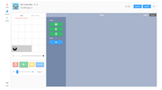

<header class='header' title='Lesson 03' subtitle='pixelBots'/>

<notable>
<iconp src='/icons/activity.png'>### Overview</iconp>
Students are introduced to writing code in the pixelBot editor. Students explore the editor to solve a series of painting challenges.

<iconp src='/icons/objectives.png'>### Objectives</iconp>
- I can code a sequence of actions in the order I want them repeated.
- I can navigate and code in an editor.

<iconp src='/icons/agenda.png'>### Agenda</iconp>

1. **Engage:** Painting with Rover (10 min)
1. **Explore:** pixelBots (10 min)
1. **Explain:** pixelBots 101 (5 min)
1. **Elaborate:** pixelBot Challenges (15 min)
1. **Evaluate:** Exit Challenge (5 min)

<note>
<iconp src='/icons/materials.png'>### Materials</iconp>
###### Teacher Materials:
- [ ] Computer
- [ ] Projector
- [ ] [Slide Show][slides]
- [ ] [Rover Code Blocks][commands]
- [ ] [Playlist: Flower Demo | Code: XPMEP][flower]

###### Student Materials:
- [ ] [Playlist: getCoding 3.3 | Code: V7G5R][playlist-one]
- [ ] [Playlist: getCoding 3.3 Exit | Code: 2BXPB][playlist-two]

</note>

## Room Design

<note>
<iconp src='/icons/vocab.png'>### Vocabulary</iconp>
- **Code:** A set of instructions designed to be carried out by a computer.
- **Sequence:** A set of actions that must be performed in the order they are written.
- **Editor:** A program designed for writing code.
</note>

<pagebreak/>

## 1. Engage: Painting with Rover (10 min)
- [ ] **Model** the new paint code block in two unplugged Rover challenges using magnetic code blocks and having a student move the rover on the tarp.
>>“Last lesson we wrote code to move our rover around the grid. Today we have a new block of code - paint. In our first challenge the rover has to paint the square it is standing next to. We can tell the rover to paint the square it is standing on by using our new paint block. Let’s tell the rover to move to that square and paint that square.”

<iconp type='question'>What instructions should we code for the rover to follow?</iconp>
<iconp type='answer'>Move 1 step, paint (put this code on the board and have a student act it out on the tarp)</iconp>
<iconp type='question'>In the second challenge what instructions should we code for the rover to follow? </iconp>
<iconp type='answer'>turn right, move 1 step, paint, move 1 step, paint (put this code on the board and have a student act it out on the tarp)</iconp>

<note></note>

- [ ] **Motivate** students by introducing the pixelBots platform using the Playlist: Flower Demo link in Teacher Materials and running the code.
>>“In today’s lesson we are going to code characters to move on a grid just like we did with the rover in our previous lesson. This time we are going to code on computers using a program called pixelBots where we can paint images by coloring squares. Here’s an example of the types of things we can do on pixelBots.”

## 2. Explore: pixelBots (10 min)

- [ ] **Challenge** the class to explore their first pixelBots challenge.
 >>“Before I show you exactly how it works, I’m going to let you play with the pixelBots editor first. Everyone say editor. An editor is a program designed for writing code. Some things you need to know first:
This part of the editor is the target grid. This grid shows what our code should make.

You can also get more information about the challenge by clicking the directions tab.

Let’s open our computers and follow these steps to try the first challenge:
Type pixelbots.io into the address bar in your browser.
Click the code icon on the bottom left of the screen and type the code you see on the board.
Click go”

<note type="tip">
Younger students with no prior experience on computers may take longer getting started. If that is the case it is ok if they just get through the guided practice in this lesson.
</note>

- [ ] **Debrief:** Students share what they discovered about pixelBots.
>>“Ok let’s close our computers and talk about what you discovered in your challenge.”

<iconp type='question'>How did you add code to the sequence you wrote?</iconp>
<iconp type='question'>How did you make the pixelBot act out the code?</iconp>
<iconp type='question'>What does the submit button do?</iconp>
<iconp type='question'>How do you reset the pixelBot?</iconp>
<iconp type='question'>How do you delete code?</iconp>
<iconp type='question'>What does the yellow button do?</iconp>
<iconp type='question'>Would anyone like to share the code they wrote to solve this challenge?</iconp>

## 3. Explain: pixelBots 101 (5 min)
- [ ] **Unpack** challenge number two in the pixelBots editor using the plan, code, validate protocol.
>>“Ok now that you’ve gotten to explore pixelBots, I’m going to show you a few more things you can do with it. I’m going to click to go to challenge 2.”

- *Plan* the path the pixelBot will follow as it paints the grid. Show the path using the slide show.
  <iconp type='question'>What do we need to do in this challenge?</iconp>
  <iconp type='question'>How do you know?</iconp>
  <iconp type='question'>Which direction is the pixelBot facing?</iconp>
- *Code* the solution while deliberately explaining how to add code to the sequence.
  <iconp type='question'>What code should I write? How do I add code?</iconp>
- *Validate* the solution by showing the class that the code can be checked by running the code with the green button. Finally, submit the code using the blue submit button.
  <iconp type='question'>How do I make the pixelBot act out the code? Did it work or do I need to debug?</iconp>
  <iconp type='question'>How do I submit the code?</iconp>

  <note></note>

## 4. Elaborate: pixelBots Challenges (15 min)
- [ ] **Guided Practice:** Students complete pixelBot challenge 3 independently using the plan, code, validate protocol. After a few minutes ask students to come up and share their answer to each question.
>>“Now it’s your turn, coders. Try challenge 3 independently. I will ask you to share your process and solution in 3 minutes.”

<iconp type='question'>*Plan:* What path did you make your pixelBot travel?</iconp>
<iconp type='question'>*Code:* What did you code?</iconp>
<iconp type='question'>*Validate:* How do you know your code works?</iconp>

<note></note>

 
- [ ] **Independent Practice:** Students work independently through the remaining challenges on the playlist.
>>“Keep coding. There are 10 more challenges for you to code in pixelBots.”

## 5. Evaluate: Exit Challenge (5 min)
- [ ] **Exit Challenge:** Students complete the exit challenge independently.
>>“Your final pixelBots challenge today I am going to ask you to submit. Code independently and show me what you know!”

</notable>

[slides]: https://docs.google.com/presentation/d/1Nm1y7M6kpWZH8N49aUBgDF_4A7Vmc4Y2XefO9IbonPs/edit?usp=sharing
[commands]: https://drive.google.com/open?id=0B48_2vIyABioU0FyTTNsR29WNUE
[flower]: http://pixelbots.io/XPMEP
[playlist-one]: http://pixelbots.io/V7G5R
[playlist-two]: http://pixelbots.io/2BXPB
