<header class='header' title='In the Loop' subtitle='Lesson 05'/>

<notable>

<iconp src='/icons/activity.png'>### Overview</iconp>
Students explore and predict how they can use loops to more efficiently write code. Allow students to discover the need for loops in the explore activity. Encourage students to make connections between loops and the real world in the elaborate activity.

<iconp src='/icons/objectives.png'>### Objectives</iconp>

- I can rewrite a repeating sequence with a loop.

<iconp src='/icons/agenda.png'>### Agenda</iconp>

1. **Engage/Explore:** Discovering Loops (15 min)
3. **Explain:** Loops (5 min)
4. **Elaborate:** Loops in the Real World (10 min)
5. **Evaluate:** Exit Challenge (15 min)

<note>
<iconp src='/icons/materials.png'>### Materials</iconp>

###### Teacher Materials:
- [ ] [Slide Show][slide-show]
- [ ] Projector
- [ ] Unplugged Foam Tiles
- [ ] Teacher Scratch Blocks
- [ ] Loop code blocks for students in envelopes
- [ ] [Socrative Quiz][soc]

###### Student Materials:
- [ ] [Maze Handout][maze-handout]
- [ ] Scratch blocks
- [ ] Pencil
- [ ] Rovers
- [ ] Computers

</note>
## Room Design

<note>
<iconp src='/icons/vocab.png'>### Vocabulary</iconp>
- **Loop:** A sequence of instructions that is continually repeated until a certain condition is reached.

</note>

<pagebreak/>
## 1. Engage/Explore: Discovering Loops (15 min)
- [ ] **Introduce** new code blocks.
>>"Today we are going to use a different set of code blocks to code our rover's movements. The turn blocks works just like the ones in pixelBot to turn the rover left and right. The move __ steps tells the rover how many steps it should move. The when green flag clicked block tells our code to run when we press the green flag. It is a way to tell our code to run just like when we press the green run button on pixelBots."

- [ ] **Challenge:** In pairs students code a sequence that will take Rover around the grid, following the dotted path. Students will not have enough move and turn blocks to finish the sequence.
> > “Now it is your turn. With your table partner navigate Rover along the dotted path on the grid. First decide who will be the Coder (write the code) and who will be the Bot (moves Rover and validates the code).”
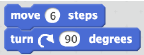

<iconp type="question">Raise your hand if you are the Coder. What is your job as Coder?</iconp>
<iconp type="answer">Check that each pair has one Coder. They will be writing the code.</iconp>
<iconp type="question">Raise your hand if you are the Bot. What is your job as Bot?</iconp>
<iconp type="answer">Check that each pair has one Bot. They will be moving Rover and validating the code.</iconp>

<note type='tip' title='Tip'>
_Younger students may need to be told to write in 90 degrees on turn blocks._
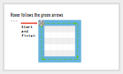
</note>

- [ ] **Discover Loops:** Do not give students the loop blocks until their group comes to you and states  that they do not have enough code blocks.  Without introducing them verbally, give each group the loop blocks as they ask for them. Guide students through using the blocks by asking questions rather than showing. One way to prompt this is to say:

>>"If you have the right question, I have the right answer."

 
<note type="tip">A common misonception is that "Repeat 1" means that the sequence will be read twice. Correct students by telling them that "Repeat 2" will cause the sequence to be read twice.</note>

- [ ] **Demo Code:** Call on one group to demo their code by bringing their code up to the board and acting it out on the unplugged maze.
Possible solutions include:
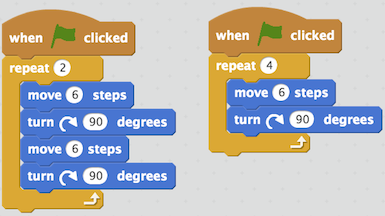

<iconp type='question' mb='1em'>Extension if students use Repeat 2: Can you rewrite your code with fewer blocks?</iconp>
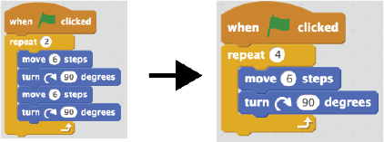

<note>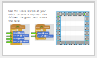</note>

## 2. Explain: Loops (5 min)

- [ ] **Predict & Define:** Have each group hold up each loop as you introduce it. Ask students for their prediction of what each loop does before you reveal its purpose.

<iconp type='question'>For each loop: What do you think this loop will do?</iconp>
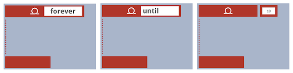
<iconp type='answer'>Forever: Repeats the nested sequence forever</iconp>
<iconp type='answer'>Repeat Until _____: Repeats the nested sequence until an action happens</iconp>
<iconp type='answer'>Repeat ____: Repeats the nested sequence that number of times</iconp>

> > "These structures are called loops. Loops are powerful tools for coders! With loops we don’t have to write a sequence of code over and over to make it repeat. Everybody say 'loop'."

<note>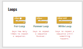</note>

## 3. Elaborate: Loops in the Real World (10 min)

- [ ] **Making Connections:** Have students identify the type of loop you would use for each of the examples below.

> > "Loops are everywhere. Let's look at some examples from our life and identify which type of loop you could use to code each example."

<iconp type='question'>The School Week <iconp ml='1em' type='answer'>Repeat Until Summer Break</iconp></iconp>
<iconp type='question'>The Seasons <iconp ml='1em' type='answer'>Forever</iconp></iconp>
<iconp type='question'>Washing Dishes <iconp ml='1em' type='answer'>Repeat Until No More Dirty Dishes</iconp></iconp>
<iconp type='question'>Riding The Tower of Terror 5 Times <iconp ml='1em' type='answer'>Repeat 5</iconp></iconp>
<iconp type='question'>Riding The Tower of Terror Until the Park Closes <iconp type='answer' mb='1em'>Repeat Until Park Closes</iconp></iconp>

<note>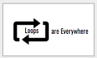
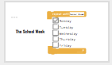
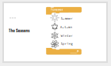
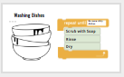
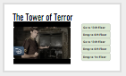
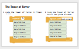</note>

- [ ] **Think Pair Share:** What other examples of loops can you come up with?

<note>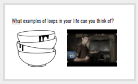</note>

## 4. Evaluate: Exit Challenge (15 min)

- [ ] **Socrative:** Students independently complete an exit challenge on Socrative. Remember to give them the Room Name. If there is time, review the answers as a class.

> > "For our closing challenge today we are going to login to Socrative to complete some challenge questions about Loops."

<note> 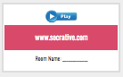
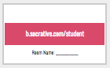
</note>

</notable>

[maze-handout]: https://drive.google.com/a/9-dots.org/file/d/0B2wBzr9vcXjPUEV0aHk4M0hMUVE/view?usp=sharing
[slide-show]: https://docs.google.com/presentation/d/1bbWIFAN66jsNqsTDXqy4OG31CUGDuPw9bRMqtKDNU-4/edit#slide=id.g1612fbdbad_0_42
[soc]: https://b.socrative.com/teacher/#import-quiz/28442633
