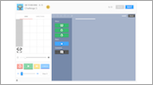
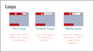
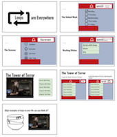

<header class='header' title='In the Loop' subtitle='Lesson 05'/>

<notable>

<iconp src='/icons/activity.png'>### Overview</iconp>
Students explore and predict how they can use loops to more efficiently write code. Allow students to discover the need for loops in the explore activity. Encourage students to make connections between loops and the real world in the elaborate activity.

<iconp src='/icons/objectives.png'>### Objectives</iconp>

- I can rewrite a repeating sequence with a loop.

<iconp src='/icons/agenda.png'>### Agenda</iconp>

1. **Engage:** Multiple Solutions (3 min)
2. **Explore:** Discovering Loops (12 min)
3. **Explain:** Loops (5 min)
4. **Elaborate:** Loops in the Real World (10 min)
5. **Evaluate:** Exit Challenge (15 min)

<note>
<iconp src='/icons/materials.png'>### Materials</iconp>

###### Teacher Materials:
- [ ] [Slide Show][slide-show]
- [ ] Projector
- [ ] Floor Grid
- [ ] [Socrative Quiz][soc]

###### Student Materials:
- [ ] Computers
- [ ] [Playlist: getCoding 3.5 | Code: YZOWD][playlist]

</note>
## Room Design

<note>
<iconp src='/icons/vocab.png'>### Vocabulary</iconp>
- **Loop:** A sequence of instructions that is continually repeated until a certain condition is reached.

</note>

<pagebreak/>
## 1. Engage: Multiple Solutions (5 min)
- [ ] **Challenge** the class to complete the first pixelBot challenge in the playlist.
>> “In today’s opening challenge we are going to code a sequence that paints the image you see on the board. You will have 1 minute to try to code your solution.”

<note></note>

- [ ] **Share:** Have a volunteer share his/her solution verbally and code it as he/she shares. Run the code to check if it is valid.

## 2. Explore: Discovering Loops (10 min)
- [ ] **Challenge** the class to solve the same coding challenge with only 4 lines of code.
>> “There are multiple ways to solve the same coding challenge. Try solving the same challenge you just solved using only 4 lines of code."

- [ ] **Share:** Students share problems they encountered while trying to come up with a solution.

<iconp type='question'>What problems did you have while trying to complete the challenge with only 4 lines of code?</iconp>

- [ ] **Challenge** the class again to solve the challenge with only 4 lines of code. This time have them click *Next* to challenge number 2. Make no reference to the loop block found in this challenge. Students should discover this on their own and explore what it does.
>>"We are going to try to solve this challenge again using only 4 lines of code. Click *Next* to get to challenge number 2 and try to code a solution there."

- [ ] **Turn and Talk:** Students discuss the approach they took to solve the challenge.

<iconp type='question'>Were you able to find a solution? What did you try this time?</iconp>

- [ ] **Share:** Volunteers share what they discussed during the Turn and Talk along with their code. Write the code that is shared in the pixelBot editor in order to validate it.

## 3. Explain: Loops (5 min)

- [ ] **Predict & Define:** Have each group hold up each loop as you introduce it. Ask students for their prediction of what each loop does before you reveal its purpose.

<iconp type='question'>For each loop: What do you think this loop will do?</iconp>

<iconp type='answer'>Forever: Repeats the nested sequence forever</iconp>
<iconp type='answer'>Repeat Until _____: Repeats the nested sequence until an action happens</iconp>
<iconp type='answer'>Repeat ____: Repeats the nested sequence that number of times</iconp>
> > "These structures are called loops. Loops are powerful tools for coders! With loops we don’t have to write a sequence of code over and over to make it repeat. Everybody say 'loop'."

<note></note>

## 3. Elaborate: Loops in the Real World (10 min)

- [ ] **Making Connections:** Have students identify the type of loop you would use for each of the examples below.

> > "Loops are everywhere. Let's look at some examples from our life and identify which type of loop you could use to code each example."

| Example                                          | Loop                              |
| -------------------------------------------------|-----------------------------------|
| The School Week                                  | Repeat Until Summer Break         |
| The Seasons                                      | Forever                           |
| Washing Dishes                                   | Repeat Until No More Dirty Dishes |
| Riding the Tower of Terror 5 Times               | Repeat 5                          |
| Riding The Tower of Terror Until the Park Closes | Repeat Until Park Closes          |

<note></note>

- [ ] **Think Pair Share:** What other examples of loops can you come up with?

## 4. Evaluate: Exit Challenge (15 min)

- [ ] **Socrative:** Students independently complete an exit challenge on Socrative. Remember to give them the Room Name. If there is time, review the answers as a class.

> > "For our closing challenge today we are going to login to Socrative to complete some challenge questions about Loops."

<note> 
</note>

</notable>

[slide-show]: https://docs.google.com/presentation/d/1jL7NYRgsPv6lLfbZWlGXswVTtAdwRlEmuKTKH4vvKok/edit?usp=sharing
[playlist]: http://www.pixelbots.io/YZOWD
[soc]: https://b.socrative.com/teacher/#import-quiz/28442633
