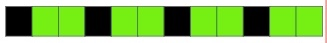
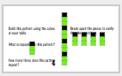
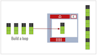
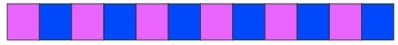
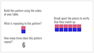
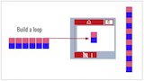
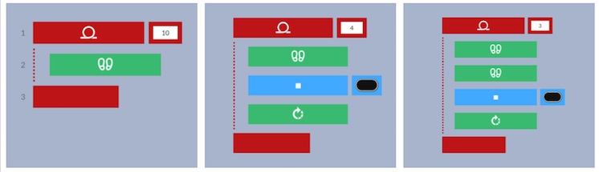
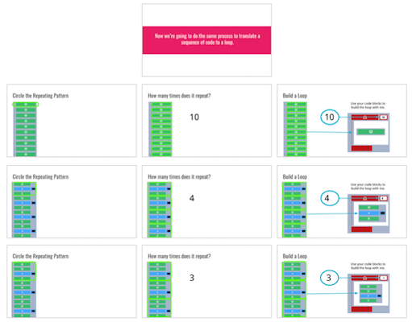
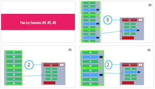

<header class='header' title='Write Loops' subtitle='Lesson 07'/>

<notable>
<iconp src='/icons/activity.png'>### Overview</iconp>
Students identify repeating patterns in a sequence and replace the repetition with more efficient code by using a loop.  This is students’ first lesson in writing code with loops. Younger students may need more support and practice with pattern recognition.

<iconp src='/icons/objectives.png'>### Objectives</iconp>
- I can rewrite a repeating sequence with a loop.

<iconp src='/icons/agenda.png'>### Agenda</iconp>
1. Engage & Explore: Patterns (10 min)
1. Explain: Translating Patterns to Loops (15 min)
1. Elaborate: Practice (10 min)
1. Evaluate: Exit Challenge (10 min)

<note>
<iconp src='/icons/materials.png'>### Materials</iconp>
###### Teacher Materials:
- [ ] Projector
- [ ] [Slide Show][slide-show]

###### Student Materials:
- [ ] Pencils
- [ ] Computers
- [ ] Unifix Cubes
- [ ] [Loops Handout][loops]
- [ ] [Code Handouts][code-handouts]
- [ ] [Exit Challenge][exit]

</note>
### Room Design

<note>

<iconp src='/icons/vocab.png'>### Vocabulary</iconp>

- **Loop:** A sequence of instructions that is continually repeated until a certain condition is reached.

</note>

<pagebreak/>
## 1. Engage/Explore: Patterns (10 min)

- [ ] **Build:** Students use unifix cubes to build the pattern they see on the slide.

> > “Build this pattern using the cubes at your table.”

<note>**Slides:**  

</note>

- [ ] **Pattern Recognition:** Students identify the pattern in the cubes.

<iconp type="question">What is repeating in this pattern?</iconp>
<iconp type="answer">Black, green, green</iconp>
<iconp type="question">Does the order matter when describing the pattern?</iconp>
<iconp type="answer">Yes! If a student said “green, black, green” then when you assemble the pieces you won’t get the same design</iconp>
<iconp type="question">How many times does the section repeat itself?</iconp>
<iconp type="answer">4</iconp>

 

- [ ] **Build:** Students use the loops handout and cubes to build a loop that describes the pattern.

<iconp type="question">How could you represent the pattern using fewer cubes and a loop block?</iconp>
<iconp type="answer">Put one of the pattern pieces inside a loop. </iconp>
<iconp type="question">What number do I write as the argument in the repeat loop? How do you know?</iconp>
<iconp type="answer">4 because the pattern repeated 4 times</iconp>

<note type="tip">The number in the loop block is called an argument.

</note>

<iconp type="question">Why do I put just one piece of the pattern inside the loop?</iconp>
<iconp type="answer">Because only that section is repeating 4 times. If you put the whole thing in the loop you’d get a much longer sequence.</iconp>

 
- [ ] **Optional:** Repeat process with second pattern.

<note>

</note>

## 2. Explain: Translating Patterns to Loops (15 min)

- [ ] **Transfer of Knowledge:** Students will follow the same process to identify the pattern in a sequence and rewrite it as a loop.

> > “Now we’re going to do the same process to translate a sequence of code to a loop.”

<iconp type="question">What is repeating in this pattern? Circle the pattern each time it repeats.</iconp>
<iconp type="answer">See slides </iconp>

<iconp type="question">How many times does the section of code repeat itself?</iconp>
<iconp type="answer">10 times                  4 times                    3 times</iconp>

<iconp type="question">How would you rewrite this as a loop? Use the code blocks at your table to build your loop.</iconp>
<iconp type="answer"></iconp>

- [ ] **Summarize:** students summarize the process they just followed in 3 steps to write code using a loop.

<iconp type="question">Describe the process we did to write a sequence of code using a loop in 3 steps? </iconp>
<iconp type="answer">
1. Identify the repeating pattern and how many times it repeats.
2. Place the repeating section of code within the loop’s mouth.
3. Place the number of times the pattern repeats as the loop’s argument.</iconp>

## 4. Elaborate: Practice (10 min)

- [ ] **Independent Practice:** Students independently follow the 3 steps to solve challenges 4, 5 & 6. Then share solutions as a class.

> > "Your turn! Work independently to rewrite the three sequences on the otherside as loops."

## 4. Evaluate: Exit Challenge (10 min)

- [ ] **Exit Challenge:** Students work independently to solve the exit challenge.

> > "I have a challenge for you! Complete the exit challenges independently on your paper."

</notable>

[slide-show]: https://docs.google.com/presentation/d/1fZDfHDFEXsVilp4-Nxg4H_rs11rrtYyypJ6SL9wX0g4/edit?usp=sharing
[loops]: https://drive.google.com/open?id=0B48_2vIyABioXy1ZcXFKZXk2X3M
[code-handouts]: https://drive.google.com/open?id=0B48_2vIyABioSlRwNlFnSVluQWM
[exit]: https://drive.google.com/open?id=0B48_2vIyABioSzFNSnRiaWdaV0k
