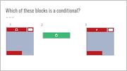
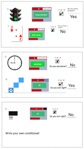
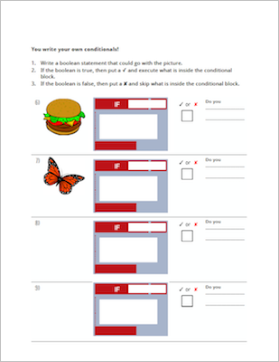
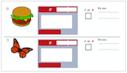
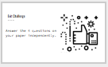

<header class='header' title='Conditionals' subtitle='Lesson 12'/>

<notable>
<iconp src='/icons/activity.png'>### Overview</iconp>
Students are introduced to conditionals (if then), practice reading conditional statements in Scratch, and identify how boolean statements are related to conditionals. Students then practice identifying conditional statements in their daily lives.

<iconp src='/icons/objectives.png'>### Objectives</iconp>
- I can identify Boolean statements as ones that evaluate to true or false.
- I can read an if-then statement to execute a sequence if a test is true.

<iconp src='/icons/agenda.png'>### Agenda</iconp>
1. Engage: Kids Code (5 min)
1. Explore: If Then (5 min)
1. Explain: Define (5 min)
1. Elaborate: Practice (20 min)
1. Evaluate: Exit Challenge (10 min)

<note>
<iconp src='/icons/materials.png'>### Materials</iconp>
###### Teacher Materials:
- [ ] Projector
- [ ] [Slide Show][slide-show]

###### Student Materials:
- [ ] Computers
- [ ] Pencils
- [ ] [Worksheets][handouts]
- [ ] [Exit Challenges][exit-challenge]

</note>

## Room Design

<note>

<iconp src='/icons/vocab.png'>### Vocabulary</iconp>

- **Boolean:** A statement that can be "true" or "false".
- **Conditional** Asks a boolean statement, and runs a chunk of code if the answer is true.

</note>
<pagebreak/>

## 1. Kids Code (5 min)
Participation: Whole Class Unplugged

- [ ] **Showcase** young student programmer and students to be the next programmer we feature.

> > “Kids all around are coding and creating. You’re never too young to start! If you code a project on your own, we would like to feature your project/app at the start of our class. Code something in Scratch or Code.org or any coding platform and show it to your getCoding teacher.”

<pagebreak/>

## 2. Explore: If Then (5 min)
Participation: Whole Class, Unplugged

- [ ] **Real World Connections:** Students fill in the if/then prompts. Note that there are no right/wrong answers to these.

- If it is raining, then _____________.
- If it is Saturday, then ____________.
- If the light is green, then ______________.
- If the pixelBot is touching the color red, then _________________.
- If the pixelBot is touching the color blue, then ___________________.

- [ ] **Classification:** Ask students to identify what all of the statements had in common.

<iconp type="question">These are called conditional statements. What do conditionals all have in common? </iconp>
<iconp type="answer">They all are “If __________, then ___________" statements.</iconp>

<iconp type="question">What do you notice about all of the “If” statements? Think about our lesson last week. </iconp>
<iconp type="answer">They are all Boolean statements. </iconp>

## 3. Explain: Define (5 min)
Participation: Whole Class, Unplugged

- [ ] **Define** conditionals - students write the definition

> > “On a blank page in your idea journal let’s write the definition of conditional. Conditional - Asks a true/false (boolean) statement, and runs a chunk of code if the answer is true.”

- [ ] **Check for understanding** -

<iconp type="question"> Which of these blocks are examples of conditionals?</iconp>
<iconp type="answer">The if-then block</iconp>

<note>
</note>

**Possible Misconceptions:**
- Students may think a loop is a conditional because of the shape, however a conditional does not repeat on its own.

## 4. Elaborate: Practice (20 min)
Participation: Whole Class, Unplugged

- [ ] **Model** how to use the steps to read conditional statements to read the first few examples on the handout together:
1. Read the If statement.
1. ✔ if the Boolean is true, read and execute what is inside the conditional
1. ✘ if the Boolean is false, skip what is inside the conditional

<note> </note>

- [ ] **Independent Practice:** Students continue to follow the read conditionals steps to finish the examples on the handout. Review the answers together as a class when students are done.

> > “Your turn. Keep following our 3 steps to finish the examples on your paper.”

- [ ] **Challenge** students to write their own conditionals and share them with the class.

>> "Your turn. Write your own conditional to go with the pictures given in #s 6 & 7. Then draw a picture and write a conditional to go with for #s 8 & 9. Try to write one Boolean that is false and one that is true."

<note type="tip">Students responses to the challenges will vary. Look for proper use of an If-Then statement with a boolean in the If box and clear directions inside the block. </note>

## 5. Evaluate: Exit Challenge (10 min)
Participation: Small Group, Independent, Unplugged

- [ ] **Exit Challenge:** Students answer the [Exit Challenge][exit-challenge] on paper using pencil independently and turn it in.

> > “Try these three challenges independently to test your new knowledge of conditionals!”

<note>
</note>

</notable>
[handouts]: https://drive.google.com/open?id=0B48_2vIyABioRWJyRV9iVWV5RlE
[exit-challenge]: https://drive.google.com/open?id=1bB_ga7Z4cczVddSfX4gG_rn_RUDpfet7pL5a2oXgOOY
[slide-show]: https://docs.google.com/presentation/d/1c8PWGq12PW2MdI4H1yah2yhEw-ZZQUeNWZZ3zOlRYN8/edit?usp=sharing
