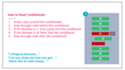
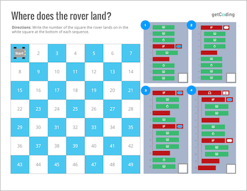
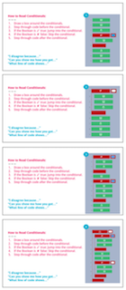
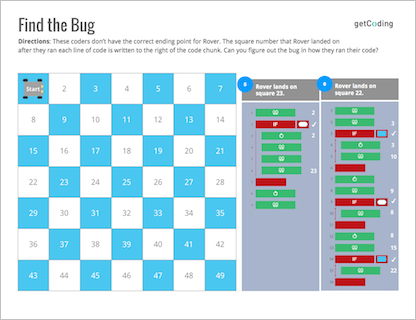
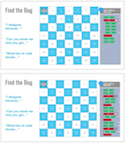
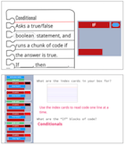
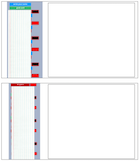
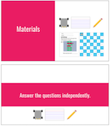

<header class='header' title='Build-a-Bot' subtitle='Lesson 13'/>

<notable>
<iconp src='/icons/activity.png'>### Overview</iconp>
Students practice reading code written with conditionals to navigate Rover on the unplugged grid and use academic discourse to debate where Rover lands. They apply their knowledge of conditionals to read code that instructs them in drawing a robot.

<iconp src='/icons/objectives.png'>### Objectives</iconp>
- I can read an if-then statement to execute a sequence if a test is true.

<iconp src='/icons/agenda.png'>### Agenda</iconp>
1. Engage: Where's Rover (20 min)
1. Explain: Reading Conditionals (5 min)
1. Elaborate: Build-a-Bot (15 min)
1. Evaluate: Exit Challenge (5 min)

<note>
<iconp src='/icons/materials.png'>### Materials</iconp>
###### Teacher Materials:
- [ ] Projector
- [ ] Rover (large)
- [ ] Floor Grid
- [ ] [Slide Show][slide-show]

###### Student Materials:
- [ ] Pencils
- [ ] Index Cards
- [ ] Rovers
- [ ] Playing Cards (min 6 per student)
- [ ] [Where's Rover Handout][handout]
- [ ] [Bots Code Handout][handout2]
- [ ] [Bots Picture Handout][handout3]
- [ ] [Exit Challenge][exit]

</note>

## Room Design

<note>

<iconp src='/icons/vocab.png'>### Vocabulary</iconp>

- **Boolean:** A statement that can be "true" or "false".
- **Conditional** Asks a boolean statement, and runs a chunk of code if the answer is true.

</note>

<pagebreak/>

## 1. Engage: Where's Rover (20 min)

- [ ] **Challenge:** Students individually practice reading code on the Where's Rover handout as they move Rover around their grid to determine where he lands. Give students time to try the problems on their own.

> > "Coders, I have a challenge for you. Use Rover to read the code on your handout and determine where Rover will land on the grid after he follows the code. Remember that when code has conditionals in it you need to also read any code that is before and after the conditional in order.
> > 	1. Read the If statement.
> > 	1. ✔ if the Boolean is true, read and execute what is inside the conditional
> > 	1. ✘ if the Boolean is false, skip what is inside the conditional"

<note></note>

- [ ] **Arugmentation** Have students argue their answer by stepping through the code and moving Rover on the large foam tiles. The discussion should be student led. Provide sentence starters for students to respond to answers they believe are not correct:
- “I disagree with your answer because…”
- “Can you show me how you got…”
- “What line of code shows that…”

<note>

</note>
 

- [ ] **Optional If Time**: On the back of the handout students use the debugging protocol to determine what error was made while reading the code.

<note> 
</note>

## 2. Explain: Conditionals (5 min)

- [ ] **Motivate:** Remind students what a conditional is and of the tools we use to read code.

> > "Conditionals are powerful tools in coding. They allow us to make decisions based on our environment. In this next challenge we're going to use conditionals to build a robot."

<iconp type="question"> The code on the side of your paper are your instructions for building your robot. What are we going to use our index cards for?</iconp>
<iconp type="answer">Uncover each line of code one at a time as we read.</iconp>
<iconp type="question"> Look at the yellow blocks of code on your paper that start with “If”. What do we call code that starts with “If”?</iconp>
<iconp type="answer">Conditionals. Bonus if they can identify the triangular Boolean statement as well.</iconp>
<note></note>

- [ ] **Model** the steps to reading conditionals as you complete your own bot on the board. When you read each Boolean statement read it “... is true”.

	Steps for reading code with conditionals:
**Don't forget to also read any code that is before and after the conditional in order.**
	1. Read the If statement.
	1. ✔ if the Boolean is true, read and execute what is inside the conditional
	1. ✘ if the Boolean is false, skip what is inside the conditional

<note></note>

## 3. Elaborate: Build-a-Bot (15 min)

- [ ] **Explore:** Students draw cards following the teacher model to complete their own bot.

> > “Your turn. Follow my steps and don’t forget to use your index card as you build your own bot.”

 

- [ ] **Share:** If time allows, call up a couple of volunteers to share their bots with the class.

## 4. Evaluate: Exit Challenge (5 min)

- [ ] **Evaluate:** Students answer the Exit Challenge on paper using pencil independently and turn it in.

> > “Try these challenges independently to test your knowledge of reading conditionals!”

<note> **Slides:**

</note>

</notable>
[handout]: https://drive.google.com/open?id=0B48_2vIyABioSjZWWGgyOXg0cTg
[handout1]: https://docs.google.com/document/d/1fSpf8pCcVZ0IOAqMHoqblKPumZ1YzYSHaOhpN-_yHrU/edit?usp=sharing
[handout2]: https://drive.google.com/open?id=0B48_2vIyABioNlNYaDRFX2VaZ1k
[handout3]: https://drive.google.com/file/d/0B48_2vIyABiobmdhS2wxWjctSGs/view?usp=sharing
[slide-show]: https://docs.google.com/a/9-dots.org/presentation/d/1OkEuFk7Qopa0cu3UrYUt3vPblmwtja9Fdx8f1W2epGw/edit?usp=sharing
[exit]: https://drive.google.com/open?id=0B48_2vIyABioSjZWWGgyOXg0cTg
