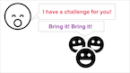
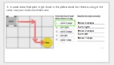
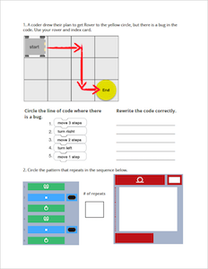
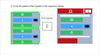
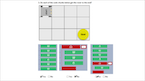
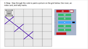
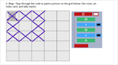

<header class='header' title='I Have a Challenge for You' subtitle='Lesson 16'/>

<notable>
<iconp src='/icons/activity.png'>### Overview</iconp>
Students complete a series of challenges to review the coding skills they’ve built since the start of the course.

<iconp src='/icons/objectives.png'>### Objectives</iconp>
This lesson reviews the objectives from Lessons 1-15.

<iconp src='/icons/agenda.png'>### Agenda</iconp>
1. Engage: I Have a Challenge For You (2 min)
1. Elaborate: Rover (23 min)
1. Elaborate: Socrative (20 min)

<note>
<iconp src='/icons/materials.png'>### Materials</iconp>
###### Teacher Materials:
- [ ] Projector
- [ ] Floor Grid
- [ ] Large Rover
- [ ] Construction Paper to mark the foam tiles
- [ ] [Slide Show][slide-show]

###### Student Materials:
- [ ] Computers
- [ ] Pencils
- [ ] Rovers
- [ ] [Rover Handout][rover]
- [ ] [Playlist: getCoding 3.16 | Code: 5GD2F][playlist]

</note>

### Room Design

<note>
<iconp src='/icons/vocab.png'>### Vocabulary</iconp>
See all vocabulary from previous lessons
</note>

<pagebreak/>
## 1. Engage: I Have a Challenge for You (2 min)
Participation: Whole class, unplugged

- [ ] **Call and Response:** teach students the call and response. Teacher says: “I have a challenge for you.” Students say: “Bring it, bring it.”

> > “Before we get started I’m going to teach you a call and response. Whenever you hear me say ‘I have a challenge for you’, you will respond ‘Bring it, bring it’. Let’s try it. ‘I have a challenge for you’ … (students respond ‘Bring it, bring it.’)”

 
<note>**Slide:** </note>

- [ ] **Motivate:** introduce our challenges for today.

> > “You have learned so much as coders since September! Today, working in partners, you get a chance to apply all of your coding skills to tackle a series of challenges."

## 2. Elaborate: Rover (23 min)
Participation: Partners, unplugged

- [ ] **Challenge:** Students move Rover around their grids to practice reading and debugging code with loops and conditionals.

> > "Your first challenge today is to move Rover around the grid to practice reading and debugging code with loops and conditionals. With a partner, carefully read and execute the code on your paper. Afterwards I will ask you to share and defend your answers to the class."

<note>
</note>
 
- [ ] **Argumentation:** Use the floor grid to have students act out code. Encourage academic discourse:
	- “I disagree because…”
	- “Show me how you got…”
	- “What line of code…”

<note type="tip">#5 is optional if you have time

</note>

## 3. Elaborate: Socrative (20 min)
Participation: Partners, online

- [ ] **Challenge:** Students login to PixelBots to complete a series of challenges similar to the ones they will complete independently on the ICC next week. This is not a test and there is no final score.

> > "Your second challenge today is on PixelBots. As you solve the challenges today, focus on activating all of your new coding super powers.

</notable>

[slide-show]: https://docs.google.com/presentation/d/1ykBVyE4sWhcRYTb2vEP9SqCJnLXWWM-8ymIB_EhZNFE/edit?usp=sharing
[socrative]: https://b.socrative.com/teacher/#import-quiz/27188219
[playlist]: http://www.pixelbots.io/5GD2F
[rover]: https://docs.google.com/document/d/11BepTZnwHYCglzDXS88IdRC2exZBVqrUj1pQlbOtCzU/edit?usp=sharing
[socrative2]: https://b.socrative.com/teacher/#import-quiz/27546630
