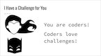
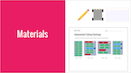
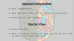

<header class='header' title='Independent Coding Challenge' subtitle='Lesson 17'/>

<notable>
<iconp src='/icons/activity.png'>### Overview</iconp>
We want to establish a coding learning culture where students identify as coders. They enjoy challenging themselves, learning new things, and addressing weaknesses in their understanding. Students complete an Independent Coding Challenge to see their progress in the learning objectives from lessons 1-16.

<iconp src='/icons/objectives.png'>### Objectives</iconp>
- I know that making mistakes is part of being a coder. I learn from my mistakes and am not afraid to try again.
- I can code a sequence of actions in the order I want them performed.
- I can code in an editor.
- I can use the debugging protocol to debug my code.
- I can rewrite a repeating sequence with a loop.
- I can step through and act out code that contains a loop.
- I can predict the effects of code that contains a loop.
- I can identify Boolean statements as ones that evaluate to true or false.
- I can read an if-then statement to execute a sequence if a test is true.
- I can write an if-then statement to execute a sequence if a test is true.

<iconp src='/icons/agenda.png'>### Agenda</iconp>
1. Engage: I Have a Challenge For You (2 min)
1. Evaluate: Challenges (43 min)

<note>
<iconp src='/icons/materials.png'>### Materials</iconp>
###### Teacher Materials:
- [ ] Projector
- [ ] [Slide Show][slide-show]

###### Student Materials:
- [ ] Pencils
- [ ] Computers
- [ ] Rovers
- [ ] Index Cards
- [ ] [Independent Coding Challenge][icc]
- [ ] [Playlist: getCoding 3.17 ICC | Code: B9XJN][icc-online]

</note>

## Room Design

<note>

<iconp src='/icons/vocab.png'>### Vocabulary</iconp>
See all vocabulary from previous lessons.

###### Symbols Key
<iconp ml='1.65em' type='question'>question</iconp>
<iconp ml='1.65em' type='answer'>answer</iconp>
- [ ] action item
</note>

<pagebreak/>
## 1. Engage: I Have a Challenge for You (2 min)
Participation: Whole class, unplugged

- [ ] **Motivate:** introduce our challenges for today.

> > “You are coders! Coders love to challenge themselves. So today we are going to do a series of Coding Challenges. We want you to see how much you have learned about coding. Some of the challenges may feel easy. Some of the challenges may feel really challenging, which is good! So coders, I have a challenge for you (pause for students to respond “bring it bring it”).”

<note> **Slides:** </note>

## 2. Evaluate: Challenges (43 min)
Participation: Independent, unplugged

<note> **Slides:** </note>

- [ ] **Expectations:** Set the expectations for a positive classroom environment for students to feel they can concentrate and push themselves.

> > - (If necessary for room setup:) Use the privacy shields to help you concentrate.
> > - We want to see your own code, so work independently.
> > - Coding takes a lot of brainpower, so keep the room silent for your fellow coders to concentrate.
> > - If you have a question or don’t understand a challenge, ask your teacher with a silent hand.

<note> </note>

- [ ] **Independent Coding Challenge:** Students work independently on the challenges. When students are finished encourage them to review and validate their answers. If a student is stuck you can help them by:
    - Reading the question out loud.
    - Asking guiding questions without giving away an answer:
	    - Do you remember when we painted with Rover?
	    - Did you validate your code to make sure there are no bugs?
	    - Did you use the index card to read each line of code one at a time?
	    - What does “sequence” mean?
	    - What is a “loop”?

> > "Let's get to the challenges. Use your index cards and enjoy!"

</notable>

[icc]: https://drive.google.com/open?id=0B48_2vIyABioYU1RT3JKNGNqUVk
[icc-online]: http://www.pixelbots.io/B9XJN
[slide-show]: https://docs.google.com/presentation/d/1X5TqFZZdFq0J41yVsawCvSV3hAGMUnEq4m0XpSPjUzU/edit?usp=sharing
