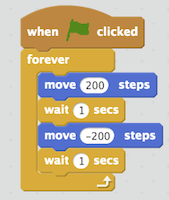
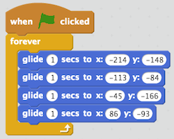
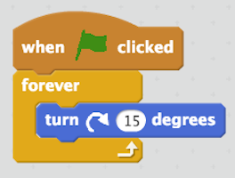

<header class='header' title='Code Loops' subtitle='Lesson 20'/>

<notable>
<iconp src='/icons/activity.png'>### Overview</iconp>
Students write loops to code the movements of the enemies in their game.

<iconp src='/icons/objectives.png'>### Objectives</iconp>
- I can code in an editor.

<iconp src='/icons/agenda.png'>### Agenda</iconp>

1. **Engage:** Enemies  (5 min)
1. **Explore:** Predictions (5 min)
1. **Explain:** Scratch Loops (10 min)
1. **Elaborate:** Code the Enemies (25 min)

<note>
<iconp src='/icons/materials.png'>### Materials</iconp>
###### Teacher Materials:
- [ ] Computer
- [ ] Projector
- [ ] [Slide Show][slides]

###### Student Materials:
- [ ] Computers
- [ ] [Escape the Maze Cheat Sheet][sheet]
- [ ] [Escape the Maze Practice][practice]
- [ ] [Escape the Maze Project][project]
- [ ] [Playlist: getCoding 3.20 | Code: ][playlist]

</note>

## Room Design

<note>
<iconp src='/icons/vocab.png'>### Vocabulary</iconp>
- **Boolean:** A statement that can be “true” or “false”.
- **Conditional:** Asks a boolean statement, and runs a chunk of code if the answer is true.
</note>

<pagebreak/>

## 1. Engage: Enemies (5 min)
- [ ] **Write Pair Share:** Students write a list of loops they see in the GIF of our Escape the Maze. They then share their lists with their partners before sharing out to the class.

<iconp type='question'>In your workbook, describe the movement that is looping for each of the enemies in this GIF of our Escape the Maze game.</iconp>
<iconp type='answer'>Red - spinning forever</iconp>
<iconp type='answer'>Green - grows & shrinks forever</iconp>
<iconp type='answer'>Yellow - moves left, moves right, forever</iconp>
<iconp type='answer'>Orange - moves in a square forever</iconp>
<iconp type='answer'>Blue - moves up, moves down, forever</iconp>
<iconp type='answer'>Black - moves left, spins, moves right, spins forever</iconp>

## 2. Explore: Predict (5 min)
- [ ] **Predict:** Students predict what code with a loop will do before stepping through it.

<iconp type='question'>Here is the code for one of the enemies we just saw. What do you predict this code will do? What movement do you think the enemy will do when it runs this code?</iconp>
<iconp type='answer'>Answers will vary.</iconp>

## 3. Explain: Scratch Loops (15 min)
- [ ] **Code Along:** Code enemy number one to patrol the maze in a back and forth motion and have students code with you.
>>“In today’s lesson we are going to be coding how the enemies move in our Escape the Maze video game. We will first code enemy number one to move back and forth in the maze. I want this enemy to move back and forth in the middle of the maze. To do this I will need a forever loop. I will also need the green flag block to start my code. To make it move to the right I will use a move 200 steps block. Then to make it move in the opposite direction I will need another move block. This time we will make it move -200 steps. When I click the green flag there seems to be a bug in my code. To fix this bug I will add a wait 1 second after each move block to allow the movements to be seen.”

- [ ] **Code Along:** Code enemy number two to patrol the maze in a zigzag  motion and have students code with you.
>>“We want enemy number two to move in a zigzag motion. To do this we will need a glide block. The glide block makes our sprites glide to specific spots on the grid. We can choose where we want our sprite to glide by dragging it to that position and then dragging and dropping the glide block into our code. Each time we place our sprite in a new spot you can see the numbers in the glide block change to show the new position. To move in a zig zag I will move my sprite to four different points I want it to travel to. Each time I move it I will place a new glide block in my code.”

- [ ] **Code Along:** Code enemy number three to spin in place and have students code with you.
>>“We want enemy number three to spin in place. To do this we will use a forever block to loop our code and an green flag block run our code. In order to get the enemy to spin all I need it to do is to turn in the same direction over and over again. To do this I will use a turn block inside of the forever loop.“

## 4. Elaborate: Code the Enemies (20 min)
- [ ] **Introduce** the coding cheat sheet.
>>“Now it’s your turn to code the rest of the enemies in the maze. Each one of you will receive a coding cheat sheet that shows an example of each one of the movements we coded for the first three enemies. You can use this cheat sheet to decide what you want the remaining enemies to do.”

- [ ] **Independent Coding:** Students code the remaining enemies using the Escape the Maze cheat sheet.
- [ ] **Extension:** Students who finish coding their enemies early can complete the pixelBot playlist titled getCoding 3.20.

</notable>

[slides]: https://drive.google.com/open?id=1ds4o8zxCpHaXc-EsQ-syG7JM1xfB7L6d0rlfEpsuNtM
[sheet]:
[practice]:
[playlist]:
