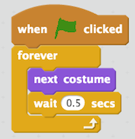
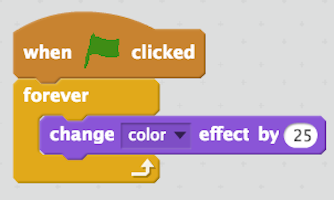
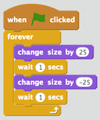

<header class='header' title='Code Loops' subtitle='Lesson 21'/>

<notable>
<iconp src='/icons/activity.png'>### Overview</iconp>
Students write loops to code the movements of the enemies in their game.

<iconp src='/icons/objectives.png'>### Objectives</iconp>
- I can code in an editor.

<iconp src='/icons/agenda.png'>### Agenda</iconp>

1. **Engage/Explore:** I Am a Sprite (10 min)
1. **Explain:** Scratch Loops (10 min)
1. **Elaborate:** Code the Enemies (25 min)

<note>
<iconp src='/icons/materials.png'>### Materials</iconp>
###### Teacher Materials:
- [ ] Computer
- [ ] Projector
- [ ] [Slide Show][slides]

###### Student Materials:
- [ ] Computers
- [ ] [Escape the Maze Cheat Sheet][sheet]
- [ ] [Escape the Maze Practice][practice]
- [ ] [Escape the Maze Project][project]
- [ ] [Playlist: getCoding 3.21 | Code: ][playlist]

</note>

## Room Design

<note>
<iconp src='/icons/vocab.png'>### Vocabulary</iconp>
-  **Boolean:** A statement that can be “true” or “false”.
- **Conditional:** Asks a boolean statement, and runs a chunk of code if the answer is true.
</note>

<pagebreak/>

## 1. Engage/Explore: I Am a Sprite (10 min)
- [ ] **Role Play:** Show 3 sequences of Scratch code and invite student volunteers to act it out.

- [ ] **Write Pair Share:** Students examine the sequence of code on the board and describe what the sprite will do when the green flag is clicked.

<iconp type='question'>What will the sprite do when the green flag is clicked?</iconp>
<iconp type='answer'>The enemy will glide to four different places on the stage.</iconp>

## 2. Explain: Scratch Loops (15 min)
- [ ] **Code Along:** Code enemy number one to flap its wings and have students code with you.
>>“In today’s lesson we are going to continue coding our enemies. In our last lesson we focused on their movements. Today we are focusing on using loops to change their appearance. We will start by making enemy number one flap its wings as it moves. Just like in our last lesson we will use a forever loop and green flag event block. To make the wings look like they are flapping we can use the bat’s costumes. When I click the costumes tab you can see that there are two versions of the bat. If I switch back and forth between the two it looks like it is flapping its wings. I can code this by going into the Looks and selecting to next costume block. When I click the green flag the bat flaps its wings a little too fast. I can fix this by placing a wait block after the next costume block.”

- [ ] **Code Along:** Code enemy number two to change colors and have students code with you.
>>“Next we are going to make enemy number two change colors while it patrols the maze. We will start with the forever and green flag blocks. To change the enemy’s color we can select the change color block from the Looks section. When we put this block inside the loop and press the green flag the enemy will change colors each time it loops through the code.”

- [ ] **Code Along:** Code enemy number three to grow and shrink and have students code with you.
>>“In our last code along we are going to make the enemy grow and shrink. We will use the green flag and forever blocks. We can change the size by going into the looks section and selecting the change size block. If we use a positive number it will grow. If we use a negative number it will shrink. This means that we have to use to of these blocks. Let’s make it grow by 25 and shrink by negative 25. If we click the green flag you can see that it does not not show very well. We can debug this by adding two wait blocks. One should go after the first change size block. The other should go after the second change block.”

## 4. Elaborate: Code the Enemies (20 min)
- [ ] **Introduce** the coding cheat sheet.
>>“Now it’s your turn to code the rest of the enemies in the maze. Each one of you will receive a coding cheat sheet that shows an example of each one of the movements we coded for the first three enemies. You can use this cheat sheet to decide what you want the remaining enemies to do.”

- [ ] **Independent Coding:** Students code the remaining enemies using the Escape the Maze cheat sheet.
- [ ] **Extension:** Students who finish coding their enemies early can complete the pixelBot playlist titled getCoding 3.21.

</notable>

[slides]: https://drive.google.com/open?id=10P6omlgbNGxu5yG71kpTe2r6gwr9kG5Nb-NHFP2tqzc
[sheet]:
[practice]:
[project]:
[playlist]:
