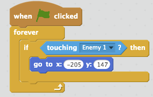
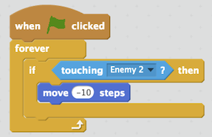
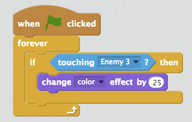

<header class='header' title='Code Conditionals' subtitle='Lesson 23'/>

<notable>
<iconp src='/icons/activity.png'>### Overview</iconp>
Students write conditionals to code the movements of the enemies in their game.

<iconp src='/icons/objectives.png'>### Objectives</iconp>
- I can code in an editor.

<iconp src='/icons/agenda.png'>### Agenda</iconp>

1. **Engage/Explore:** Meet the Enemy (5 min)
1. **Explain:** Code Alongs (15 min)
1. **Elaborate:** Enemy Interactions (25 min)

<note>
<iconp src='/icons/materials.png'>### Materials</iconp>
###### Teacher Materials:
- [ ] Computer
- [ ] Projector
- [ ] [Slide Show][slides]

###### Student Materials:
- [ ] Computers
- [ ] [Escape the Maze Conditionals Cheat Sheet][sheet]
- [ ] [Playlist: getCoding 3.23 | Code:][playlist]

</note>

## Room Design

<note>
<iconp src='/icons/vocab.png'>### Vocabulary</iconp>
</note>

<pagebreak/>

## 1. Engage/Explore: Meet the Enemy (5 min)
- [ ] **Write Pair Share:** Students observe and describe the interaction between the hero and the enemy in the GIF by responding to the questions below. They then share their observations and descriptions with a partner before sharing out to the class.

<iconp type='question'>What was the hero doing in the beginning of the video?</iconp>
<iconp type='question'>What made it do something else?</iconp>

- [ ] **Discuss** how to complete the statement below based on the observations from the GIF. Then discuss the type of code blocks that would be necessary to code the interaction.

<iconp type='question'>How would you complete this sentence to describe the GIF you just saw? If the hero, ________________ then _________________.</iconp>
<iconp type='answer'>If the hero touches the enemy, then go back to the beginning.</iconp>

<iconp type='question'>What type of code blocks would be necessary to code this interaction between the hero and the enemy?</iconp>
<iconp type='answer'>If-then conditional blocks</iconp>

## 2. Explain: Code Alongs (15 min)
- [ ] **Code Along:** Code the hero so that it goes back to the beginning of the maze once if it touches enemy number 1.
>>“In today’s lesson we are going to code interactions between the hero and the enemies using conditional blocks. The first interaction we will code is the one that you saw in the GIF. We will make the hero go back to the beginning of the maze if it touches enemy number one. We will use an if-then conditional block and a touching boolean block. We want the hero to sense enemy number one so we will select enemy one in the drop down menu. To make this code run we need a green flag event block at the beginning. Inside of our conditional we need code that will make the mouse go back to the start. We will use the ‘go to’ block to make this happen. This block works like the glide block we have used. If we place the mouse on the spot we want it to go to the numbers will show up in the block. X should be -205 and y should be 147. If we click the green flag and make the hero touch enemy one nothing happens. The reason is that the code runs one time only. The code needs to run the entire time we are playing the game. This means we need to nest our code in a forever loop. Now when I click the green flag the mouse will go back to the start of the maze when it touches enemy one.”

- [ ] **Code Along:** Code the hero so that it moves backwards if it touches enemy number 2.
>>“In our next code along we will make the hero move backwards if it touches enemy number two. We will use all of the same conditional, boolean, forever, and green flag blocks for this. This time we will choose enemy two from the drop down menu. To make the hero move backwards if it touches the enemy we will use the move block with a negative number. If we use a negative ten, click the green flag and touch enemy two we can see that the code works.”

- [ ] **Code Along:** Code the hero so that it changes colors if it touches enemy number 3.
>>“In our final code along we will make the hero change colors if it touches enemy three. We will use the same blocks again. This time we will choose enemy three from the drop down menu. To change the hero’s color we can go into the looks category and choose the change color block. Now if we click run and touch enemy three the hero changes colors.”

## 3. Elaborate: Interactions (25 min)
- [ ] **Introduce** the coding cheat sheet.
>>“Now it’s your turn to code the rest of the hero’s interactions with the remaining enemies. Each one of you will receive a conditionals coding cheat sheet that shows an example of each one of the interactions we coded. You can use this cheat sheet to decide what you want the remaining interactions to be.”

- [ ] **Independent Coding:** Students code the remaining enemy interactions using the Escape the Maze conditionals cheat sheet.
- [ ] **Extension:** Students who finish coding their enemies early can complete the pixelBot playlist titled getCoding 3.23.

</notable>

[slides]: https://drive.google.com/open?id=1G-xxUgM1qQRKgSpMCkLHFWr3I0IfrWpnonbAPgCIw7g
[sheet]:
[playlist]:
