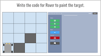
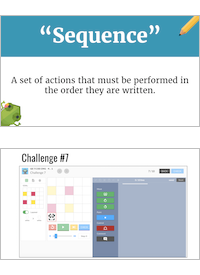
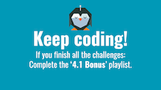
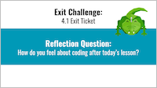

<header class='header' title='Writing Sequences' subtitle='Lesson 01'/>

<notable>
<iconp src='/icons/activity.png'>### Overview</iconp>
In lesson 1 students are introduced to the program, PixelBots. They explore how the program works and what tools are available as they practice writing sequences. They will also engage in discussion to identify what they have discovered on PixelBots.

<iconp src='/icons/objectives.png'>### Objectives</iconp>
- I can write a program to solve a challenge.

<iconp src='/icons/agenda.png'>### Agenda (60 min)</iconp>
1. Engage: Rover (3 mins)
1. Explore: PixelBots (15 mins)
1. Explain: PixelBots Discovery (15 mins)
1. Elaborate: Write Sequences (20 mins)
1. Evaluate: Exit Ticket/Reflection (7 mins)

<note>
<iconp src='/icons/materials.png'>### Materials</iconp>
###### Teacher Materials:
- [ ] Computer
- [ ] Projector
- [ ] Word Wall
- [ ] [Slide Show][slides]

###### Student Materials:
- [ ] Computer
- [ ] Pencils
- [ ] Student Journals
- [ ] [Playlist: 4.01 Practice | Code: ER45D][practice]
- [ ] [Playlist: 4.01 Exit Ticket | Code: XY42C][exit]
- [ ] [Playlist: 4.01 Bonus | Code: X87OA][extension]

</note>

## Room Design

<note>
<iconp src='/icons/vocab.png'>### Vocabulary</iconp>
- **Sequence:** A set of actions that must be performed in the order they are written.
</note>

<pagebreak/>

## 1. Engage: Rover (3 min)
- [ ] **Motivate** students by displaying grid with Rover and ask students to help you write the code for Rover to paint.
  >>"Coders! Welcome to your second year in getCoding. You learned so much last year and I'm so proud of you all for creating a super cool video game. This year we are going to level up and learn a brand new platform called PixelBots! Before we jump in, I want you to think back to last year. You're going to need all your coding knowledge to help me solve our first challenge with Rover."

- [ ] **Engage** students in a conversation about multiple solutions (after Rover makes his first move one step and paint).
  >>"Is there more than one way we can move Rover to the next box that he needs to paint? Which ways could we go? Are they both correct?”

- [ ] **Explain:** After students help you to write the code, explain that writing code is something they already know how to do; however, this year we will use a different platform.
  >>“Reading, writing, and debugging code is something you already know how to do! The only difference is that this year we will be using a different platform called PixelBots.”

<note></note>

## 2. Explore: PixelBots (15 min)
- [ ] **Introduce** students to PixelBots and show them how to log in.
  >>“Today we are going to use PixelBots for the first time to write sequences. First, let’s log in and get acquainted with pixelBots. To understand what PixelBots has to offer, you are going to explore some challenges!”

- [ ] **Show** the students how to log in and open Challenge 1.

- [ ] **Challenge:** As students work on Challenge 1, walk around the room to spot check and guide any students who need help with the navigational tools that PixelBots has to offer.

## 3. Explain: PixelBots Discovery (15 min)
- [ ] **Discussion:** Project Challenge 1 and solve with students while you explain the tools embedded in the program. Finish by asking the questions below to facilitate discussion. As they review what a sequence is, add it to a standing word wall that will be added to throughout the year as they learn new concepts.

<iconp type='question'>What do you notice is similar to Scratch?</iconp>
<iconp type='answer'>Ex. there is a space to write code, there are blocks that move the sprite forward and turn.</iconp>
<iconp type='question'>What did you just do? Read code? Write code? Debug?</iconp>
<iconp type='answer'>Ex. we just wrote code. We wrote a sequence.</iconp>
<iconp type='question'>What is a sequence?</iconp>
<iconp type='answer'>A set of actions that must be performed in the order they are written.</iconp>

<note></note>

## 4. Elaborate: Write Sequences (20 min)
- [ ] **Independent Practice:** Students work independently as they continue to complete the series of challenges in the PixelBots playlist.
  >>“Now that we have discovered how PixelBots works, I want you to continue to complete the series of challenges in PixelBots to write sequences.”

- [ ] **Monitor** students as they work through the playlist.

- [ ] **Review** Challenge 7 with students before assigning the exit ticket. Have students share out their steps for writing the code as you code along on the projector.

<note></note>

## 5. Evaluate: Exit Ticket (7 min)
- [ ] **Exit Challenge:** Students complete PixelBots exit ticket. When finished, they can log out and use notepads to reflect.

<iconp type='question'>How do you feel about coding after today’s lesson? Draw a picture and/or use words.</iconp>

<note></note>

</notable>

[slides]: https://drive.google.com/open?id=1LDw_R6LVAbm4s47cernAGCY2N6YZIctG58kg86Wcn4s
[practice]: http://www.pixelbots.io/ER45D
[exit]: http://www.pixelbots.io/XY42C
[extension]: http://www.pixelbots.io/X87OA
