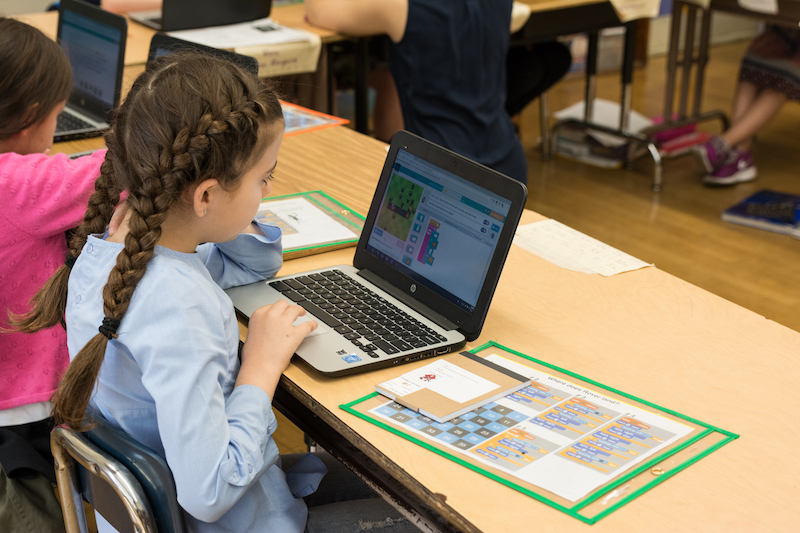

## Archived

The 3-5 series features project and product based curricula designed to introduce and reinforce applied learning in projects motivated by the product design cycle. The lessons in these units are couched in the context of an overarching product that the student is working on developing. Students will create games, apps, and collaborative worlds.

## Curriculum
- [2016-2017 3rd Grade](../3-5/grade-3/index.html)
