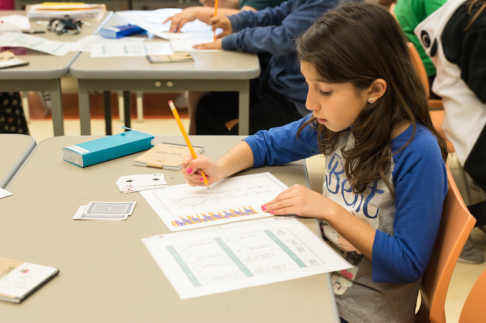

# 2016-2017 3rd Grade

Students begin applying core coding concepts into an Escape the Maze project. In this level, students are introduced to the Scratch block-based language and the offline maze grid. These platforms help student experience and understand new coding concepts such as sequencing, creating loops, and using conditionals.

## Overview: Escape the Maze
In this 27-lesson course, students master computational thinking skills and the fundamentals of coding to build an interactive maze game with multiple obstacles, enemies, and levels. These lessons incorporate unplugged and online activities that build connections between coding concepts and apply them to projects. Along with hard skills in coding, students learn the processes and mindsets of a computer programmer. Students learn to approach failure as an opportunity, collaborate with peers on writing and reviewing code, and tap into their own creativity without reservations. At the end of the course students apply their knowledge of the software design process to plan an unplugged event - a class-wide Arcade Day - in which they share their final maze projects and celebrate their development as a coder.

## Purpose
1. Empower students to use computational practices to analyze problems, build solutions, and be creative.
2. Empower students to apply computational practices to understand and change the world.

## Big Goals
1. Students will utilize computational thinking to read their world and will utilize their coding skills to write their world.
2. Students will experience failure as a learning opportunity to master core concepts and the process of creation.
3. Students will collaboratively build software and assess its effectiveness for users.

## Big Ideas
1. Software is built by composing simple, common coding building blocks.
2. Reusable and robust software is readable, modular, and testable.
3. Impactful software is built iteratively and collaboratively through stages of planning, enacting, and assessing.
4. When code breaks, we fearlessly, creatively, and systematically debug it.

## Essential Questions
1. How can we use coding building blocks to design something new or break something down?
2. When your code breaks or when you get stuck, what can you do?
3. How do you write code that other programmers can use?
4. How do you adapt your software to meet the needs of your users?

## Lessons
| Title                | Description        | Objectives |
| ---------------------|--------------------| -----------|
| [Lesson 1: I am a Coder](../grade-3-archived/lesson-plans/lesson-1.html) | In this lesson, students discover the importance of code in today’s world. Additionally, students will repeatedly encounter failure in a positive way through an interactive problem-solving game. They should begin to view failure as a step towards succeeding. | I am not afraid to fail. I succeed by learning why I failed and trying again. |
| [Lesson 2: If You Give a Mouse a Cookie](../grade-3-archived/lesson-plans/lesson-2.html) | In this lesson, students will learn to login to Scratch and begin to use the editor, block palette, and stage to sequence a program. | I can use the editor, block palette, and stage in Scratch to code my program. |
| [Lesson 3: Rover](../grade-3-archived/lesson-plans/lesson-3.html) | In this lesson, students learn the importance of giving clear and explicit directions. They practice sequencing code, writing code, and navigating their robot on a paper grid. | I can code a sequence of actions in the order I want them performed. |
| [Lesson 4: Escape the Maze](../grade-3-archived/lesson-plans/lesson-4.html) | Students are introduced to the Escape the Maze project they will be working on throughout the year. They will brainstorm how to improve on the starter version of the game and learn to read the starter code through code along videos while getting more familiar with Scratch. | I can read the project starter code in Scratch. |
| [Lesson 5: In the Loop](../grade-3-archived/lesson-plans/lesson-5/lesson.html) | In this lesson students explore and predict how they can use loops to more efficiently write code. Allow students to discover the need for loops in the explore activity. Encourage students to make connections between loops and the real world in the elaborate activity. | I can replace a repeating sequence with a loop to increase code efficiency and readability.|
| [Lesson 6: Rover Paint](../grade-3-archived/lesson-plans/lesson-6/lesson.html) | Students learn to read code with loops by stepping through one block at a time. Using pre-written code, students guide Rover the robot’s movements as it paints a grid. | I can step through and act out code that contains a loop. |
| [Lesson 7: Enemies on Patrol](../grade-3-archived/lesson-plans/lesson-7/lesson.html) | Students practice reading code by predicting, stepping through, and summarizing the code of enemies 1-3 in the maze game. Enemies have repeating behavior so students will have to be comfortable reading code that has loops. | I can step through and act out code that contains a loop. |
| [Lesson 8: Code the Enemy](../grade-3-archived/lesson-plans/lesson-8/lesson.html) | In this lesson students identify repeating patterns in a sequence and replace the repetition with more efficient code by using a loop. This is students’ first lesson in writing code with loops. Younger students may need more support and practice with pattern recognition. | I can code a loop that makes an enemy patrol my maze. |
| [Lesson 8 Accelerated: Code the Enemy](../grade-3-archived/lesson-plans/lesson-8-accelerated/lesson.html) | In this lesson students identify repeating patterns in a sequence and replace the repetition with more efficient code by using a loop. This is students’ first lesson in writing code with loops. Younger students may need more support and practice with pattern recognition. | I can code a loop that makes an enemy patrol my maze. |
| [Lesson 9: Independent Coding Challenge](../grade-3-archived/lesson-plans/lesson-9/lesson.html) | We want to establish a coding learning culture where students identify as coders. That means they enjoy challenging themselves, they enjoy learning new things, and they like to address weaknesses in their understanding. Students complete an Independent Coding Challenge to see their progress in the learning objectives covered in lessons 1-8. | Objectives from lesson 1-8. |
| [Lesson 10 part 1: ICC Review](../grade-3-archived/lesson-plans/lesson-10-part1/lesson.html) | We want to establish a coding learning culture where students enjoy challenging themselves, enjoy learning new things, and like to address weaknesses in their understanding. Students review their Independent Coding Challenges from Lesson 9 and acknowledge their progress as coders while addressing bugs in their code. | Objectives from lesson 1-8. |
| [Lesson 10 part 2: Enemies Everywhere](../grade-3-archived/lesson-plans/lesson-10-part2/lesson.html) | This lesson assumes you are completing it in the same period as the ICC review. As a class we write the code for an enemy to patrol the maze while applying their knowledge of loops. This process begins on the unplugged maze and then moves into coding in Scratch. | I can code a loop that makes an enemy patrol my maze. |
| [Lesson 11: Enemies Everywhere Continued](../grade-3-archived/lesson-plans/lesson-11/lesson.html) | Students will begin their Game Plan to plan how each enemy will move in their Escape the Maze project. They will then write the code in the Scratch editor to make each enemy move using loops. | I can code a loop that makes an enemy patrol my maze. |
| [Lesson 12: Strategic Enemies](../grade-3-archived/lesson-plans/lesson-12/lesson.html) | In this lesson we begin to talk about user experience in the context of designing enemies that increase the level of difficulty of the game without making it impossible to win. Students apply their knowledge of writing loops to improve on their enemies' code. | I can code a loop that makes an enemy patrol my maze. |
| [Lesson 13: Debugging Loops](../grade-3-archived/lesson-plans/lesson-13/lesson.html) | Students are introduced to the debugging protocol and practice applying it to a series of debugging challenges in Scratch. | When my code fails, I use the debugging protocol to debug my code. |
| [Lesson 14: Boolean](../grade-3-archived/lesson-plans/lesson-14/lesson.html) | Students are introduced to “boolean” and practice identifying true/false statements. | I can identify Boolean as true/false statements. |
| [Lesson 15: Conditionals](../grade-3-archived/lesson-plans/lesson-15/lesson.html) | Students are introduced to conditionals (if then), practice reading conditional statements in Scratch, and identify how boolean statements are related to conditionals. | I can read an if-then statement to execute a sequence if a test is true. |
| [Lesson 16: Build-a-Bot](../grade-3-archived/lesson-plans/lesson-16/lesson.html) | Students practice reading code written with conditionals that instructs them in drawing a robot. They then Code Along to write conditionals in Scratch that allow their Sprites to interact with each other. | I can read an if-then statement to execute a sequence if a test is true. |
| [Lesson 17: Debugging Conditionals](../grade-3-archived/lesson-plans/lesson-17/lesson.html) | Students continue to build their debugging skills by reading a bug ticket and using the debugging protocol to tackle a series of challenges within the Escape the Maze game. They then add conditionals to their Game Plan for their final project. | When my code fails, I use the debugging protocol to debug my code. |
| [Lesson 18: Write Conditionals](../grade-3-archived/lesson-plans/lesson-18/lesson.html) | Students apply their knowledge of conditionals to write code in their Escape the Maze projects that cause the hero and enemies to interact. | I can write a conditional (if-then) to make my maze hero and enemies interact. |
| [Lesson 19: Where's Rover](../grade-3-archived/lesson-plans/lesson-19/lesson.html) | Students continue to practice reading conditionals with Rover. They build their argumentation skills to debate where Rover lands. Independently, students continue to practice writing conditionals and loops as they work on their Escape the Maze projects. | I can read an if-then statement to execute a sequence if a test is true. |
| [Lesson 20: I Have a Challenge for You](../grade-3-archived/lesson-plans/lesson-20/lesson.html) | Students complete a series of challenges to review the coding skills they’ve built since the start of the course. | This lesson reviews the objectives from Lessons 1-19. |
| [Lesson 21: Independent Coding Challenge](../grade-3-archived/lesson-plans/lesson-21/lesson.html) | We want to establish a coding learning culture where students identify as coders. They enjoy challenging themselves, learning new things, and addressing weaknesses in their understanding. Students complete an Independent Coding Challenge to see their progress in the learning objectives from lessons 1-20. | Objectives from lesson 1-21 |
| [Lesson 22: Bug Tickets](../grade-3-archived/lesson-plans/lesson-22/lesson.html) | Students use their game plan to work on their final Escape the Maze project. If students get stuck they practice filling out a Bug Ticket to follow the 3 steps to debug and get assistance from their peers. | When my code fails, I use the debugging protocol to debug my code.|
| [Lesson 23: User Experience](../grade-3-archived/lesson-plans/lesson-23/lesson.html) | Students are introduced to giving constructive feedback on user experience. They practice giving and incorporating feedback from a peer to improve the user experience of their game. | I can give and receive feedback on user experience. |
| [Lesson 24: Arcade](../grade-3-archived/lesson-plans/lesson-24/lesson.html) | Students share their final projects and give each other feedback on user experience. They complete the final getCoding survey. | I can give and receive feedback on user experience. |
