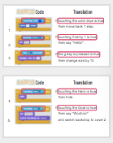

<header class='header' title='Read Conditionals 1' subtitle='Lesson 14'/>

<notable>
<iconp src='/icons/activity.png'>### Overview</iconp>
Students are introduced to conditionals (if then), practice reading conditional statements in Scratch, and identify how boolean statements are related to conditionals.

<iconp src='/icons/objectives.png'>### Objectives</iconp>
- I can identify Boolean as true/false statements.
- I can read an if-then statement to execute a sequence if a test is true.

<iconp src='/icons/agenda.png'>### Agenda</iconp>
1. Engage: Kids Code (5 min)
1. Explore: If Then (5 min)
1. Explain: Define (5 min)
1. Elaborate: Conditionals in Scratch (5 min)
1. Evaluate: Exit Challenge (5 min)

<note>
<iconp src='/icons/materials.png'>### Materials</iconp>
###### Teacher Materials:
- [ ] Projector
- [ ] [Slide Show][slide-show]

###### Student Materials:
- [ ] Computers
- [ ] [Exit Challenges][exit-challenge]
- [ ] [True/False cards][boolean-cards]
- [ ] Idea Journals
- [ ] Pencils
- [ ] Dry erase markers
- [ ] [Lesson 14 Handouts][handouts]

</note>

## Room Design

<note>

<iconp src='/icons/vocab.png'>### Vocabulary</iconp>

- **Boolean:** A statement that can be "true" or "false".
- **Conditional** Asks a boolean statement, and runs a chunk of code if the answer is true.

</note>
<pagebreak/>

## 1. Kids Code (5 min)
Participation: Whole Class Unplugged

- [ ] **Showcase** a young student programmer by sharing a project from a fellow coder. Play the game and show the code behind it.

> > “Kids all around are coding and creating.”

 

<note>
</note>

- [ ] **Challenge** students to be the next programmer we feature.

> > “If you code a project on your own, we would like to feature your project/app at the start of our class. Code something in Scratch or Code.org or any coding platform and show it to your getCoding teacher.”

<note>
</note>

 

- [ ] **Motivate** students by connecting today’s lesson to their Escape the Maze game.

> > “In Lesson 12, what happened when the hero touched an enemy? The hero was sent back to the start! This is caused by conditional statements. Today we will be learning about conditionals, the foundation to programming enemies that react when the hero touches them.”

 

<note>
</note>

- [ ] **Connecting Prior Knowledge:** Review question #3 from Lesson 13 Exit Challenge.

<iconp type="question"> A lot of coders made this error on their exit challenge last week. When coders get a problem wrong they debug! What was the error here?</iconp>

<iconp type="answer">7 + 3 is not a boolean, it is not a true/false statement and does not have pointed ends</iconp>
<note>
</note>

<pagebreak/>

## 2. Explore: If Then (5 min)
Participation: Small Group Unplugged

- [ ] **Real World Connections:** Students fill in the if/then prompts. Note that there are no right/wrong answers to these.

- If it is raining, then _____________.
- If it is Saturday, then ____________.
- If the light is green, then ______________.
- If the enemy is touching the hero, then _________________.
- If the hero is touching the goal, then ___________________.

<note>
</note>

- [ ] **Classification:** Ask students to identify what all of the statements had in common.

<iconp type="question">These are called conditional statements. What do conditionals all have in common? </iconp>
<iconp type="answer">They all start with “If __________, then ___________.</iconp>

<iconp type="question">What do you notice about all of the “If” statements? Think about our lesson last week. </iconp>
<iconp type="answer">They are all Boolean statements. </iconp>

## 3. Explain: Define (2 min)
Participation: Small Group Unplugged

- [ ] **Define** conditionals - students write it in their idea journals
> > “On a blank page in your idea journal let’s write the definition of conditional. Conditional - Asks a true/false (boolean) statement, and runs a chunk of code if the answer is true.”

<note>
</note>

- [ ] **Check for understanding** -

<iconp type="question"> Which of these blocks are examples of conditionals? </iconp>
<iconp type="answer">The if-then block</iconp>

<iconp type="question"> Which of these blocks are examples of boolean? </iconp>
<iconp type="answer"> 4 is less than 5 </iconp>

<note>
</note>

**Possible Misconceptions:**
- Students may think a loop is a conditional because of the shape, however a conditional does not repeat on its own.
- Students may think a boolean is a conditional, but a boolean is just a part of a conditional.
- Students may think 4+5 is a boolean because of the color and numbers, but a boolean block has points on the ends and can be answered with True or False.

## 4. Elaborate: Conditionals in Scratch (10 min)
Participation: Small Group Unplugged

- [ ] **Translation** - In pairs students rewrite the Scratch conditionals on the handout in an if-then statement. Do one example together. It’s ok if students don’t complete all of them.

> > “With your table partner, translate the conditional statements the Scratch code to English. Let’s do the first one together.”

<note type="tip">Younger grades that are not as proficient in writing can do this as a Pair-Share activity where they say their statement to their partner and then share out to the class.

</note>

- [ ] **Popcorn** - Pop around the room asking students to read their translation of each conditional and then identify the boolean statement.

**Extension Questions for Advanced Groups:**
<iconp type="question">Which of these conditionals would change you to the next level if you touch the goal? </iconp>
<iconp type="question">Which of these conditionals sends you back to the start if you touch an enemy?</iconp>

<note>
</note>

## 5. Exit Challenge (3 min)
Participation: Small Group, Independent, Unplugged

- [ ] **Exit Challenge:** Students answer the [Exit Challenge][exit-challenge] on paper using pencil independently and turn it in.

> > “Try these three challenges independently to test your new knowledge of conditionals!”

<note>
</note>

</notable>
[handouts]: https://docs.google.com/document/d/1GNLjhQ46PKIzcA7039MJXRfX9eE_XnBmLQ6NE7YgK_s/edit?usp=sharing
[exit-challenge]: https://docs.google.com/document/d/1W62TkE9xkMoGnFAeSZI7Uk-FSAP9WaWX5RVsS4w-4wM/edit?usp=sharing
[boolean-cards]: https://docs.google.com/document/d/1ENgpq-WdFCHz869IwJ9gVTF9bnf_TYze7dyVgDiy6uE/edit
[slide-show]: https://docs.google.com/presentation/d/1O5q0HkabIMtdP2OXq1G49SF_l6rh687KUs2Opn4u08Q/edit?usp=sharing
