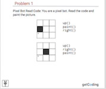
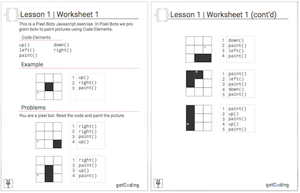

<header title='pixelBots Unplugged' subtitle='Lesson 1'/>

<notable>

<iconp src='/icons/activity.png'>### Overview</iconp>
Students program pixelBots to paint, focusing on sequencing in an unplugged lesson.

<iconp src='/icons/objectives.png'>### Objectives</iconp>
- Students will be able to read, write, and execute code in a sequence.

<iconp src='/icons/agenda.png'>### Agenda</iconp>

#### Length: 55 minutes

1. Engage: Welcome to Coding (10 minutes)
1. Explore: Predict pixelBot (10 minutes)
1. Explain: Sequence (15 minutes)
1. Evaluate: Read Code (20 minutes)

<note>

<iconp src='/icons/materials.png'>### Materials</iconp>

#### Teacher Materials
- Computer
- Projector
- [Lesson 1 Slides][slides]
- Whiteboard
- Small & large pixelBots
- Magnetic Large pixelBot

#### Student Materials
-  [Lesson 1 | Warm-up Worksheet][warm-up]
-  Lesson 1 | Worksheet: [Page 1][worksheet1-1] & [Page 2][worksheet1-2]
-  Small pixelBot
-  Pencils

<iconp src='/icons/vocab.png'>### Vocabulary</iconp>
- **Sequence** - The idea that statements must be performed in the order they are written.
- **Function call** - A programming element that tells the computer to do something. In the beginning, most function calls will cause the computer to perform an action.

</note>
<pagebreak/>
#### 1. Engage: Welcome to Coding (10 minutes)

- [ ] **Discuss** coding and what it means to be a coder. Introduce students to the world of coding and get them excited about its endless possibilities.
  >> "Welcome to coding! Starting with this class you are now coders. Let's watch a video about a coder and take a look at a website's code. "

  - Watch video: [A day in the life of a software engineer][video].
  - Use inspector on Chrome to show code of websites.
      - View > Developer > Developer Tools
  <iconp type='question'>What do you think it is important to be a coder?</iconp>
  <iconp type='question'>Where is code used in our world?</iconp>
  <iconp type='answer'>computers, games, autonomous cars, streetlights, etc.</iconp>

<note>**Slides:**
</note>

#### 2. Explore: Predict pixelBot (10 minutes)

- [ ] **Explore:** Students individually predict the outcome of sequences.
  - Distribute [Lesson 1 | Warm-up Worksheet][warm-up] and [small pixelBots cutout][zebra]
  >>"Before we can write code, we need to learn how to read code. Predict the outcome of the sequence of code."

<note>
**Solution:**

</note>

- [ ] **Turn and talk:** Students turn in pairs and discuss their predictions.

- [ ] **Discuss & Define** code elements. Student write definitions of each code element in their coding journals.
  <iconp type='question'>What do the elements at the top of the worksheet mean?</iconp>
  <iconp type='answer'>up() - move up one square</iconp>
  <iconp type='answer'>down() - move down one square</iconp>
  <iconp type='answer'>right() - move to the right one square</iconp>
  <iconp type='answer'>left() - move to the left one square</iconp>
  <iconp type='answer'>paint() - paint the square that the pixel bot is on top of</iconp>
  >>"These coding elements tell the zebra to do an action. Coders also call these function calls. Function calls have an open and closed parenthesis."

<note>
**Slides:**
</note>

- [ ] **Discuss:** Compare the two sequences of code.
  <iconp type='question'>Which function calls/coding elements do each program use?</iconp>
  <iconp type='answer'>paint(), up(), right()</iconp>
  <iconp type='question'>What is the difference between the two sequences of code?</iconp>
  <iconp type='answer'>The order of the function calls/coding elements.</iconp>
  <iconp type='question'>Does the order of the function calls matter?</iconp>
  <iconp type='answer'>Yes!</iconp>
>>"When a computer executes code, it runs it in the order that it is written. This is called sequence."

<note>
</note>

<pagebreak/>
#### 3. Explain: Sequences (15 minutes)

- [ ] **Model** how to read code by stepping and acting through two [example programs][examples].
  1. Ask yourself out loud, "What is the first line of code?"
  1. Number the corresponding line.
  1. Read line of code.
  1. Move magnetic pixel bot.
  1. Continue reading and stepping one line at a time (number, read, move).

<note>
**Slides:**
</note>

- [ ] **Guided Practice:** Read and step through remaining example pixelBots sequences together as a class.
  1. Ask for a volunteer
  1. Student goes to board
    1. Numbers next line of code
    1. Reads next line out loud
    1. Moves magnetic pixel bot
  1. Repeat until challenge is complete

<note>
</note>
<pagebreak/>

#### 4. Elaborate: Read Code (20 minutes)

- [ ] **Independent Practice:** Students read the code and paint the correct squares on the worksheet.
  - Distribute Worksheet 1: [Page 1][worksheet1-1] & [Page 2][worksheet1-2]

- [ ] **Review** answers together as a class. (slide 14, click through slide for all 5 problems)
  - Call one student to come to board and paint the squares.
  - If students disagree, step through code.
  - Repeat till all problems are reviewed.

**Solutions:**

<note>
**Slides:**
</note>

</notable>
[slides]: https://docs.google.com/presentation/d/1AxnXgymp9W3WUrzoMwoxiQgptNwZ05WovB6mPlVQHXg/edit?usp=sharing
[examples]: https://docs.google.com/document/d/1pGYzK-w0euwkLx8v_Ko-WICLXUPVuSpq4pA1s1eSuwI/edit?usp=sharing
[video]: http://tinyurl.com/q966xd5
[zebra]: ../../worksheets/zebrabot.pdf
[warm-up]: ../../worksheets/lesson1-warmup.pdf
[worksheet1-1]: ../../worksheets/lesson1-worksheet1-1.pdf
[worksheet1-2]: ../../worksheets/lesson1-worksheet1-2.pdf
