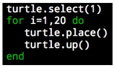

<header title='Loops' subtitle='Flower Garden: Lesson 3'/>

<notable>

<iconp src='/icons/activity.png'>### Overview</iconp>
Students are introduced to loops in Lua on Minecraft. Students will be able to use loops for repetitive sequences of code.

<iconp src='/icons/objectives.png'>### Objectives</iconp>
- I can write a loop in Lua to build structures in Minecraft.

<iconp src='/icons/agenda.png'>### Agenda</iconp>

#### Length: 60 minutes

1. Engage/Explore: Tall Pillar (15 minutes)
1. Explain: Loops (7 minutes)
1. Elaborate: Build Challenges (28 minutes)
1. Evaluate: Exit Challenge (10 minutes)

<note>

<iconp src='/icons/materials.png'>### Materials</iconp>

#### Teacher Materials
- Computer
- Projector
- MinecraftEdu
- [Lesson 3 Slides][slides]

#### Student Materials
- Computer
- MinecraftEdu

<iconp src='/icons/vocab.png'>### Vocabulary</iconp>
- **Loop:** A sequence of instructions that is repeated a set number of times.

</note>
<pagebreak/>
#### 1. Engage/Explore: Tall Pillar (15 minutes)

- [ ] **Challenge:** Introduce the build challenge: building a 20 block high pillar in Minecraft.
  >>“Coders, you’ve done a great job these past few days learning how to code turtle to build structures. Today I want to start off with a special build challenge! I want you to code turtle to build a 20 block high pillar. When I say go, I want you to open your laptops, log into Minecraft, and start coding. Ready, set, go!”

- [ ] **Discuss:** Facilitate a class discussion about the build challenge.
  <iconp type='question'>How was that challenge? </iconp>
  <iconp type='answer'>Students should point out that it takes a lot of lines of code. It takes 40 lines of code to build this tall structure. </iconp>
  <iconp type='question'>What do you notice about the code? I need a volunteer to read the code out loud?</iconp>
  <iconp type='answer'>Students should recognize a pattern, turtle.place, turtle.up, turtle.place, turtle.up, ...</iconp>
  <iconp type='question'>How would you describe this sequence to someone?</iconp>
  <iconp type='answer'>Students should get to some point where they say the pattern is turtle.place, turtle.up and the pattern repeats 20 times.</iconp>

  >>“You can rewrite a repeating sequence of code using two pieces of information, what is repeating, also known as the core of a pattern, and how many times it repeats. Let’s take a look at how we write this in Lua.”

#### 2. Loops (7 minutes)

- [ ] **Code Along:** Students follow along on their own computer as you walk through each step of coding a loop to build a 20 block high pillar in Minecraft. Set up students with 20 blocks of any colored wool.
  - **Steps:**
    1. Place 20 blocks of wool into turtle’s inventory slot 1.
    1. Create a new file and title it “ ___ “
    1. Write the first part of the loop “for i=1, 20 do”
      - “We want to repeat our code 20 times, so we type i=1,20, if we wanted our code to repeat 5 times what would we type instead?"
    1. Next type the lines of code you want to repeat. We want to repeat ‘turtle.place()’ and ‘turtle.up()’
    1. To end a loop we type ‘end’
  - Code:
    

#### 3. Elaborate: Build Challenges (28 minutes)

- [ ] **Independent Practice:** Students continue to program turtle to build in Minecraft. Students reference build challenges in Minecraft that require them to use loops.
  >>“Now that we’ve learned how to code and use loops, you can continue coding turtle to build the challenges in Minecraft.”

#### 4. Evaluate: Exit Challenge (10 minutes)
- [ ] **Exit Challenge:** Students work independently to write a program to code turtle to build a 2x2 base column that is 5 blocks high.
  >>“Okay coders, I have a challenge for you. *pause for students’ response*   Use a loop to program turtle to build a column that has a 2x2 square base and is 5 blocks high! You will work on this challenge independently to show me and yourself what you learned this lesson.”

- [ ] **Evaluate:** Circulate and check students code to determine student’s understanding of moving turtle and using loops.

</notable>
[slides]:https://docs.google.com/document/d/1JPOQtD8r3tYMww-JLYrjcihE49IVFEytzmlv9377hig/edit?usp=sharing
