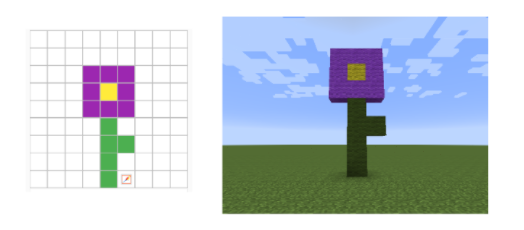

<header title='Prototype' subtitle='Flower Garden: Lesson 4'/>

<notable>

<iconp src='/icons/activity.png'>### Overview</iconp>
Students begin their Minecraft Flower Garden Project by prototyping their design on PixelBots. Then students can begin coding turtle to build their design in Minecraft.

<iconp src='/icons/objectives.png'>### Objectives</iconp>
- I can prototype a design on a grid in PixelBots that I can code my turtle to build in Minecraft.

<iconp src='/icons/agenda.png'>### Agenda</iconp>

#### Length: 60 minutes

1. Engage: Make a Plan (10 minutes)
1. Explore/Explain: Painting in PixelBots (5 minutes)
1. Elaborate: Prototype (45 minutes)
1. Evaluate: Check Prototypes

<note>

<iconp src='/icons/materials.png'>### Materials</iconp>

#### Teacher Materials
- Computer
- Projector
- MinecraftEdu
- [Lesson 4 Slides][slides]

#### Student Materials
- Computer
- MinecraftEdu
- [Minecraft Project | Prototype (code: JR4Y3)][prototype]

<iconp src='/icons/vocab.png'>### Vocabulary</iconp>
- **Prototype:** a first functional form of a new design

</note>
<pagebreak/>
#### 1. Engage/Explore: Make a Plan (10 minutes)

- [ ] **Motivate:** Facilitate a discussion about the importance of planning when doing a project. Show students an unnumbered list of the process needed plan and build their project.
  - Code & Build - code turtle to build prototype in Minecraft
  - Ideate - brainstorm ideas for a flower design
  - Prototype - plan & draft a design on PixelBots

  <iconp type='question'>Today you will start your Flower Garden Project. How does this list relate our lesson?</iconp>
  <iconp type='answer'>Students should notice the list is what they need to do to do their project.</iconp>
  <iconp type='question'>What do you notice about the order?</iconp>
  <iconp type='answer'>The list is in the wrong order. First we need to ideate, prototype, then code & build.</iconp>

  >>“Before we go into Minecraft and build, we need to plan out what we will be building.”

- [ ] **Independent Exploration:** Students will brainstorm all their possible ideas for a flower design in their coding journal.
  >>“List as many ideas as you can for your flower design. Color, size, specific type of flower, like a sunflower, a rose, or a tulip.”

#### 2. Explain: Painting in PixelBots (5 minutes)

- [ ] **Model:** Create a flower design on PixelBots. Demonstrate using the paint and eraser tool on PixelBots to paint their prototype. 	
  >>“I decided for my project to create a purple flower. Watch as I show you how to create a prototype on PixelBots. Your flower design should have a stem, leaf/leaves, and petals.”

#### 3. Elaborate: Prototype (45 minutes)

- [ ] **Prototype:** Guide students to log into PixelBots. Students prototype their flower on PixelBots challenge Minecraft | Prototype (code: JR4Y3).
 >>“Now it’s your turn, take your ideas and prototype a flower design on PixelBots.”

 - Example Flower prototype in PixelBots and build in Minecraft:
 

- [ ] **Model:** After giving students some time to prototype, model how to start project in Minecraft.
  >>“After you have your completed prototype on PixelBots, you can begin coding in Minecraft. Create a new file, name it, and write comments to help outline your code. We will have code for the stem, leaves, and petals so we should have stem, leaves, and petals as comments.”

- [ ] **Project Time:** Students complete their prototypes and begin coding their flower in Minecraft. When students have finished their prototypes, let them know they will be displaying their final build in a Showcase Area in Minecraft.
  >>“Today marks the first day of your project. In a few days you will have a complete build of your prototype which will be on display in our Showcase Area. But before you can have a completed project, you need to go through the steps of coding a few lines and testing your program. Each day you work on your project, I want you to create a sign with your name and the date and place it next to what you coded turtle to build for that day. When it comes to the showcase, we will be able to see the progress and the steps you took from Day 1 till the Day of the Showcase.”

#### 4. Evaluate: Check Prototypes

- [ ] **Evaluate/Circulate:** While students work independently, circulate and check in with each student. Review their prototype and progress on Minecraft.
  - Check for:
    - Finished Prototype: Flower Prototype will have stem, leaves, and petals
    - Comments in Minecraft for each part of flower.

</notable>
[slides]:https://docs.google.com/presentation/d/19OB-_3thKmnzu8DxU5Gujq0aMTCWMXJ7mUo4JwDLHbc/edit?usp=sharing
