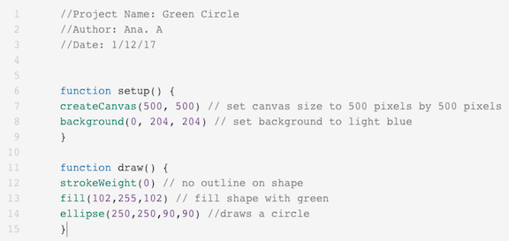

<header title='Shapes & Mouse Input' subtitle='Lesson 1'/>

<notable>

<iconp src='/icons/activity.png'>### Overview</iconp>
Students discover how code is used to create art. Students learn the basics of P5.js and code their first shapes. At the end of the session, students learn how to make their sketch interactive with the mouse input variable.

<iconp src='/icons/objectives.png'>### Objectives</iconp>
- Students will be able to create shapes of different colors and sizes in P5.js.
- Students will be able to use mouseX and mouseY as arguments to make code interactive in P5.js.

<iconp src='/icons/agenda.png'>### Agenda</iconp>
###### Length: 60 minutes
1. Engage: You can code art! (7 mins)
2. Explore: Robot Sketch (10 mins)
3. Explain: Open Processing Interface (13 mins)
4. Elaborate: Create a Sketch (20 mins)
5. Evaluate: Exit Ticket (10 mins)

<note>

<iconp src='/icons/materials.png'>### Materials</iconp>

###### Teacher materials
- [ ] Projector
- [ ] Computer
- [ ] [Lesson 1 Slides][slides]
- [ ] [Beat Machine Example][beatmachine]
- [ ] [Robot Sketch][robot]

###### Student materials
- [ ] Computer
- [ ] Open Processing Account
- [ ] [Beat Machine Example][beatmachine]
- [ ] [Robot Sketch][robot]
- [ ] [P5.js reference zine][zine]
- [ ] [Grid Paper][gridpaper]
- [ ] pencil
- [ ] coding journal

<iconp src='/icons/vocab.png'>### Vocabulary</iconp>

</note>
<pagebreak/>

#### Engage: You can code art! (7 minutes)
- [ ] **Engage** students in a discussion about art and how art can be created with code. Show patatap and processing connexions as examples of coded art.
  <iconp type='question'> What mediums do you like to use when creating art?</iconp>
  <iconp type='answer'> Colored pencils, paint, clay, etc. </iconp>
  <iconp type='question'> What is interactive art? Has anyone experienced interactive art?</iconp>
  <iconp type='answer'> Rain room, infinity mirror room, etc. </iconp>
  >> “In this class we are going to learn to create interactive art with code! Before we start coding, let's take a look at what's possible.”

  - [Patatap.com][example2]

<note>
Examples of interactive art rooms
- [Yayoi Kusama's Infinity Mirrored Room][infinity] at The Broad
- [Random International’s Rain Room][rain] at LACMA
</note>

- [ ] **Motivate:** Students see an example project by interacting with [visual beat machine project][beatmachine] on their computer. Ask for observations and introduce processing, a language to code for the visual arts.
  >>“The coding language we will use is called p5.js. It’s a JavaScript library that starts with the original goal of Processing, to make coding accessible for artists and designers! Go to openprocessing.org and interact with this project.”

  <iconp type='question'> What is happens when I press a certain key or move my mouse? </iconp>
  <iconp type='question'> What do you hear and see? </iconp>

#### Explore: Robot Sketch (10 minutes)

- [ ] **Explore:** Students explore [Robot Sketch][robot] by changing the arguments in the fill function calls. Students will reference the mini zine for specific colors.
  >> "Here is a reference sheet of P5.js. Use this as a resource in this class. Turn to the RBG color page. Use this page to help guide how you change values for the fill function calls in this sketch."

- [ ] **Discuss** how changing values in the code change/affected the sketch. Ask students the question and give them a minute to try changing values, then students share their observations.
  <iconp type='question'> What happens if you change the numbers in the fill function calls?</iconp>
  <iconp type='question'> What happens if you change the numbers in the rect function call and ellipse function call?</iconp>
  <iconp type='question'> What happens if you change 'width/2' to 'mouseX' and 'height/2' with 'mouseY'?</iconp>

#### Explain: Open Processing Interface (13 minutes)

- [ ] **Explain** the Open Processing interface:
  - Play/Replay: Plays your sketch
  - function setup () { } : Sets up your canvas. Runs only once.  
  - function draw () { } : Animates and draws things onto your canvas. Runs in a loop.  
  - // : A comment is a line that gets ignored when the code is run. This is useful for adding notes.
  >>"P5.js sketches have two functions. Function setup and function draw. The code is setup is run only once. The code in draw runs in a loop. You can create comments in your code by using two slashes."

- [ ] **Demonstrate** a bug/syntax error in your program by deleting a curly brace in one of the functions and pressing play.
  <iconp type='question'> What happens if I delete a curly brace and then run my code?</iconp>

- [ ] **Model** logging into openprocessing account and how to start a sketch. Draw an ellipse with no outline and filled with color. Add comments of name and date at the beginning of sketch.
<note type="reminder" title="Reminder">
// Comment lines of code.
</note>

- [ ] **Explain** canvas, coordinate system, and pixels
  - Canvas: Think of the canvas just like an art canvas and your code is your paint. What is the keyboard? (paintbrush)
  - Coordinate system: Unlike the Cartesian coordinate system, here (0,0) starts at the top left corner.
  - Pixels: Unit of measurement on a computer screen (tiny dots of RGB that make up your screen).

#### Elaborate: Create a Sketch (20 minutes)
- [ ] **Independent Practice:** Students create a sketch consisting of:
  - At least three shapes of various sizes and colors.
  - Making sketch interactive by replacing integer arguments with mouseX and mouseY to make the sketch interactive.
  - Example sketch of [9 Dots logo][logo]  
  >>"Now that we've explored openprocessing, take the next 20 minutes to practice drawing shapes and using MouseX and MouseY to create a sketch with at least three shapes and uses MouseX and MouseY."

#### Evaluate: Exit Ticket (10 minutes)
- [ ] **Call and Response:** teach students the call and response. Teacher says: “I have a challenge for you.” Students say: “Bring it, bring it.”
  >> “Before we get started I’m going to teach you a call and response. Whenever you hear me say ‘I have a challenge for you’, you will respond ‘Bring it, bring it’. Let’s try it. ‘I have a challenge for you’ … (students respond ‘Bring it, bring it.’)”

- [ ] **Exit Challenge:** Students work independently to write a program to draw a blue square and a red circle with a yellow background.
  >> “Okay coders, I have a challenge for you. *pause for students’ response*   Use what we learned today draw a circle that changes size with when you move the mouse and a square that follows the mouse pointer.”

- [ ] **Evaluate:** Circulate and check students code to determine student’s understanding of drawing shapes of different colors and setting a background color.

</notable>
[slides]:https://docs.google.com/presentation/d/1oCB6il3OnvJ9YKfD9wNR-lnLKRE-nlKYSZdZ81K3UEA/edit?usp=sharing
[zine]:https://docs.google.com/document/d/1_S-nlYJVSYOe-gK_cARrc4L6jT_rAmfIuofJ0rvoQpY/edit
[beatmachine]:https://www.openprocessing.org/sketch/406443
[infinity]: http://www.thebroad.org/art/exhibitions/yayoi-kusama-infinity-mirrored-room
[rain]: http://www.lacma.org/rainroom#about
[gridpaper]: ../../worksheets/gridpaper.pdf
[example]: https://vimeo.com/24930344
[example2]: http://patatap.com/
[logo]: https://www.openprocessing.org/sketch/398615
[robot]: https://www.openprocessing.org/sketch/436173
