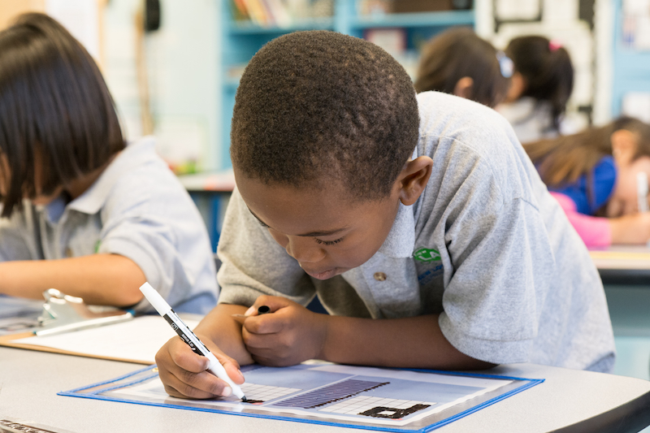

# getCoding K-2

The K-2 series serves as an introduction to reading, writing, and debugging code for pre-readers. Beginning coders develop a foundational level of understanding of fundamental coding concepts through unplugged activities, games, and the [pixelBot][pixel-bot] platform.

## Curriculum
- [Kindergarten](../k-2/kindergarten/index.html)
- [1st Grade](../k-2/grade-1/index.html)

[pixelBot]: www.pixelbot.io
