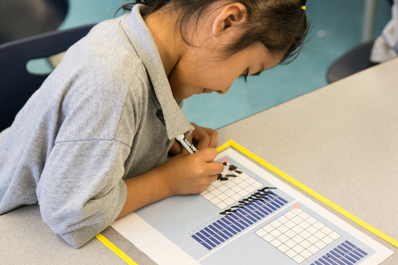

# 1st Grade

## Purpose
1. Empower students to use computational thinking practices to analyze problems, build solutions, and be creative.
2. Empower teachers to teach coding / best practices in computational thinking instruction.
3. Empower students to share code to communicate their thinking, open their thinking up to critique, and revise their thinking.

## Big Goals
- Students will identify as coders.
- Students will experience bugs as learning opportunities.
- Students will be fluent in reading, writing, and debugging code.
- Students will share their thought process around coding, and respond to each other’s thoughts.

## Understandings
Students will understand that...

1. Bugs in programs are inevitable and can be fixed.
2. Coders fearlessly take on problems and challenges and view mistakes as opportunities for reflection and learning.
3. In some cases, multiple solutions can achieve the same result and one solution isn’t necessarily better than the others.

## Essential Questions
1. How would I decide which program to use when there are multiple solutions?
2. When might loops and conditionals improve my program?
3. What can I do when I encounter a bug in my code?
4. How does participating in discussion with others improve my code?

## Sequence

| Title             | Description        | Objectives |Practice|
| ------------------|--------------------| -----------|--------|
| [Lesson 01: Move Forward & Turn](../grade-1/lesson-plans/lesson-1/lesson.html)| In lesson 1 students learn to sequence with a more limited set of commands. Students transition from coding with directional moves to coding with turns and forward moves.| I can write a PixelBot program with turns and forward moves. |Write |
| [Lesson 02: Multiple Solutions](../grade-1/lesson-plans/lesson-2/lesson.html)| In lesson 2 students learn to write multiple solutions to solve a challenge. | I write more than one solution to solve a challenge. | Write |
