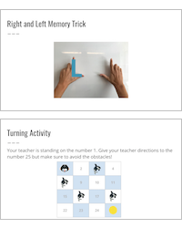

<header class='header' title='Move Forward & Turn' subtitle='Lesson 1.01'/>

<notable>
<iconp src='/icons/activity.png'>### Overview</iconp>
In the introductory lesson, coders build on prior knowledge of navigating PixelBots to code with new commands. This lesson serves to refresh students on concepts covered in the kindergarten curriculum.

<iconp src='/icons/objectives.png'>### Objectives</iconp>
- I can write a PixelBot program with turns and forward moves.

<iconp src='/icons/agenda.png'>### Agenda (45 min)</iconp>
1. Engage: Left & Right (5 min)
1. Explore: Exploring PixelBots (5 min)
1. Explain: Learning the Moves (10 min)
1. Elaborate: PixelBot Practice (20 min)
1. Evaluate: Debrief (5 min)

<note>
<iconp src='/icons/materials.png'>### Materials</iconp>
###### Teacher Materials:
- [ ] Computer
- [ ] Projector
- [ ] [Left/Right Papers (1 set)][left]
- [ ] [Slide Show][slides]

###### Student Materials:
- [ ] Computers
- [ ] [Playlist: 1.01 Practice | Code: G233B][practice]
- [ ] [Playlist: 1.01 Bonus | Code: 3E565][extension]

</note>

## Room Design

<note>
<iconp src='/icons/vocab.png'>### Vocabulary</iconp>
- **Code:** A set of instructions designed to be carried out by a computer.
</note>

<pagebreak/>

## 1. Engage: Left & Right (5 min)
- [ ] **Demonstrate** how to distinguish between left and right from the point of view of the PixelBot.
  >>“Coders, today we are going to learn a new way to code our PixelBots. In kindergarten we used arrows to move our PixelBots up, down, left, and right. This year we are going to code our PixelBots to turn left and right before moving.”

<iconp type='question'>Who can show me which hand is their left hand?</iconp>
<iconp type='question'>Who can show me which hand is their right?</iconp>
<iconp type='answer'>Gauge student understanding through hand raising.</iconp>

<note></note>

- [ ] **Reveal** slides to walk students through how to justify their reasoning when asked questions about navigational turns.
  >>“Take a look at the PixelBot on the board. You can see that on her left I wrote the word, “Left”, and on her right I wrote the word, “Right.”

<iconp type='question'>If she turned this way, what do you think I told her to do? Turn right, or turn left?</iconp>

<note></note>

- [ ] **Challenge** students to lead the teacher (with a penguin backpack to represent the PixelBot) to navigate an obstacle challenge using the grid and obstacles. The teacher should hold the blue left paper in their left hand and the red right paper in their right hand to help students understand that these directions change based on point of view.

## 2. Explore: Exploring PixelBots (5 min)
- [ ] **Turn and Talk:** Show the side-by-side comparison of a PixelBot using directional moves and a PixelBot using turns and forward moves. Then have students discuss the question below.

<iconp type='question'>How is the PixelBot on the left moving differently from the PixelBot on the right?</iconp>
<iconp type='answer'>On the left, the PixelBot is just stepping to the side, but on the right, the PixelBot turns and then moves.</iconp>

<note></note>

## 3. Explain: Learning the Moves (10 min)
- [ ] **Model** how to code using the new turn and forward move blocks to navigate the PixelBot using challenge one.

<iconp type='question'>When you turn left or right, does the PixelBot move forward? Where does she move?</iconp>
<iconp type='answer'>No, she doesn’t move forward. She stays in place.</iconp>

<iconp type='question'>How do we know where the PixelBot’s left and right are?</iconp>
<iconp type='answer'>We have to think like we’re looking through the PixelBot’s eyes!</iconp>

<note></note>

## 4. Elaborate: PixelBot Practice (20 min)
- [ ] **Independent Coding:** Have students work through the rest of the challenges in the PixelBot playlist.

<note></note>

- [ ] **Monitor** the class for students in need of additional assistance.

- [ ] **Extension:** Have students who finish early work on the PixelBot extension playlist.

## 5. Evaluate: Debrief (5 min)
- [ ] **Motivate** students to reflect on their new skill as coders.
>> “Today, we learned about how to code solutions to our challenges with turns and forward moves."

<iconp type='question'>What part of coding class was the most challenging today?</iconp>

<note></note>

</notable>

[left]: https://drive.google.com/open?id=1WjZUwEaPvG6EmdxXJYSRKwLkkuiJ_5VX-zLNUfew_Zc
[large]: https://drive.google.com/open?id=1Mb9-h9Hp12HMagC3U-3n4CaQj8Gp_93RWQUQNdIQtC4
[slides]: https://drive.google.com/open?id=1-f6reV9IoN51T4eGLKvRcsTb5hukkQ_ffQtfaVD4pfs
[tokens]: https://drive.google.com/open?id=1WjVvupynL7FuvuSwMS_IKNYxj8mHVcwnHGM5Bmr213g
[practice]: http://www.pixelbots.io/G233B
[extension]:http://www.pixelbots.io/3E565
