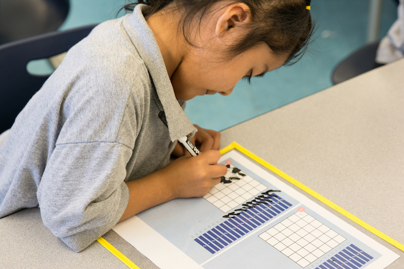

# Kindergarten

## Purpose
1. Empower students to use computational thinking practices to analyze problems, build solutions, and be creative.
2. Empower teachers to teach coding / best practices in computational thinking instruction.
3. Empowering students to share code to communicate their thinking , open their thinking up to critique, and revise their thinking.

## Big Goals
- Students will identify as coders.
- Students will experience mistakes as learning opportunities.
- Students will apply core computational thinking concepts (algorithms, pattern recognition, control, and abstraction) to problem solving.
- Students will be fluent in reading, writing, and debugging code.
- Students will share, defend, and revise their thinking based on evidence.

## Understandings
Students will understand that...

1. Programs can be shared, discuss, critiqued, and revised.
2. Programs are built iteratively and collaboratively through a cycle of planning, coding, and validating.
3. Bugs in programs are inevitable and can be fixed
systematically by comparing, finding, and fixing.
4. Coders fearlessly take on problems and challenges and view mistakes as opportunities for reflection and learning.

## Essential Questions
1. How are algorithms, patterns and loops used to solve problems?
2. What is the most efficient way to fix a bug in my code?
3. How do I learn from a mistake?

## Sequence

| Title             | Description        | Objectives |Practice|
| ------------------|--------------------| -----------|--------|
| [Lesson 01: Mystery Robot](../kindergarten/lesson-plans/lesson-1/lesson.html)| In lesson 1 students are introduced to the concept of productive failure through a story about a little girl and her quest to build a magnificent machine. Students discuss their takeaways from the story and apply the productive failure mindset to solve a mystery.| I can identify what I learned from my mistakes.|Debugging |
| [Lesson 02: pixelBotGo](../kindergarten/lesson-plans/lesson-2/lesson.html) |In lesson 2 students develop a set of commands to communicate with their pixelBot. The commands are then used to code solutions for a series of navigation challenges that require a single line of code.|I can develop and use a set of commands to direct my pixelBot’s movements.|Write|
| [Lesson 03: Multiple Steps](../kindergarten/lesson-plans/lesson-3/lesson.html)|In lesson 3 students use multiple commands to direct their pixelBot’s movement.|I can use more than one command to move my pixelBot.|Write|
| [Lesson 04: Step-By-Step](../kindergarten/lesson-plans/lesson-4/lesson.html)|In lesson 4 students practice reading code by stepping one line at a time in an unplugged space.|I can step through a 2-5 line sequence of code.|Read|
| [Lesson 05: PixelBots](../kindergarten/lesson-plans/lesson-5/lesson.html)|In lesson 5 students begin writing code on the the PixelBot platform.|I can control the actions of my PixelBot with code.|Write|
| [Lesson 06: Code Your PixelBot](../kindergarten/lesson-plans/lesson-6/lesson.html)|In lesson 6 students continue writing code. The complexity of the challenges is increased by the minimum number of lines of code needed in the solution.|I can write a 2-5 line sequence of code.|Write|
| [Lesson 07: Find the Bug](../kindergarten/lesson-plans/lesson-7/lesson.html)|In lesson 7 students are introduced to the concept of debugging. Students use the stepping skills practiced in the previous lesson to find and remove unwanted lines of code.|I can find and remove a bug in a 2-5 line sequence of code.|Debug|
| [Lesson 08: Invisible Bugs](../kindergarten/lesson-plans/lesson-8/lesson.html)|In lesson 8 students continue debugging by identifying locations where code is missing. Students step through the sequence of code, identify where a line of code is missing, and add the missing code.|I can add a missing line of code to fix a 2-5 line sequence of code.|Debug|
| [Lesson 09: Code-A-Thon](../kindergarten/lesson-plans/lesson-9/lesson.html)|In lesson 9 students tackle increasingly complex coding challenges by using the plan, code, validate protocol.|I can write a 6-10 line sequence of code. |Write|
| [Lesson 10: Step-It-Up](../kindergarten/lesson-plans/lesson-10/lesson.html)|In lesson 10 students practice stepping through increasingly complex code.|I can step through a 6-10 line sequence of code.|Read|
| [Lesson 11: Where is the Bug?](../kindergarten/lesson-plans/lesson-11/lesson.html)|In lesson 11 students use the compare, find, fix, debugging protocol to identify and remove bugs in increasingly complex code.|I can find and remove a bug in a 6-10 line sequence of code.|Debug|
| [Lesson 12: Bug Detectives](../kindergarten/lesson-plans/lesson-12/lesson.html)|In lesson 12 students use the compare, find, fix debugging protocol to add missing lines of code to increasingly complex code.|I can add a missing line of code to fix a 6-10 line sequence of code.|Debug|
| Lesson 13: Review|In lesson 13 students review in preparation for Independent Coding Challenge I. |I can write 2-10 line sequences of code. I can step through 2-10 line sequences of code. I can find and remove bugs in 2-10 line sequences of code. |Review|
| Lesson 14: Independent Coding Challenge I|In lesson 14 students take the Independent Coding Challenge I.|I can write 2-10 line sequences of code. I can step through 2-10 line sequences of code. I can find and remove bugs in 2-10 line sequences of code. |Assessment|
| Lesson 15: Patterns|In lesson 15 students learn how to identify the core of a pattern and the number of times it repeats. The lesson begins with an introduction to patterns in which students examine a series of color, number, shape, and animal patterns in order to develop a definition of a pattern as a class. Students then learn to continue existing patterns as a way to identify the core of a pattern.|I can identify the core of a pattern and the number of times it repeats.|Read|
| Lesson 16: Patterns in Code|In lesson 16 students apply their ability to identify the core of a pattern and the number of times it repeats in the context of pixelBot code.|I can identify the core of a pattern and the number of times it repeats in a sequence of code|Read|
| Lesson 17: Repeat It|In lesson 17 students apply their ability to identify the core of a pattern and the number of times it repeats to refactor sequences of pixelBot code with loops.|I can repeat a sequence of code.|Write|
| Lesson 18: Looping Back|In lesson 18 students learn how to read loops and practice stepping through them.|I can step through a loop of code.|Read|
| Lesson 19: Loopy Bugs|In lesson 19 students apply their ability to step through loops to find and remove bugs.|I can find and remove a bug in a loop of code.|Debug|
| Lesson 20: Buggy Loops|In lesson 20 students apply their ability to step through loops to add missing lines of code to loops.|I can add a missing line of code to a loop.|Debug|
| [Lesson 21: Decomposing Letters](../kindergarten/lesson-plans/lesson-21/lesson.html)|In lesson 21 students are introduced to decomposition. Students develop their own definition and learn to produce usable decompositions.|I can decompose an image into smaller, usable pieces.|Write|
| [Lesson 22: Decompose and Code](../kindergarten/lesson-plans/lesson-22/lesson.html)|In lesson 22 students code images by using decomposition in the planning phase.|I can code a decomposed image.|Write|
| [Lesson 23: Summarizing Sequences](../kindergarten/lesson-plans/lesson-23/lesson.html)| In lesson 23 students are introduced to summaries. Students practice summarizing code by stepping through pixelBot sequences that produce images on a grid. Students use the images and summarize them verbally using sentence stems.|I can summarize a sequence of code.|Read|
| [Lesson 24: Summarizing Chunks]((../kindergarten/lesson-plans/lesson-24/lesson.html))|Lesson 24 builds on lesson 23’s introduction to summarizing. Students learn that in addition to summarizing a sequence of code as a whole, smaller chunks of code within that sequence can also be summarized.|I can summarize a chunk of code.|Read|
| Lesson 25: Review|In lesson 25 students review in preparation for Independent Coding Challenge II.|I can write 2-10 line sequences of code. I can step through 2-10 line sequences of code. I can find and remove bugs in 2-10 line sequences of code. I can loop a sequence of code. I can step through a loop of code. I can find and remove a bug in a loop of code. I can add a missing line of code to a loop.|Review|
| Lesson 26: Independent Coding Challenge II|In lesson 26 students take Independent Coding Challenge 2.|I can write 2-10 line sequences of code. I can step through 2-10 line sequences of code. I can find and remove bugs in 2-10 line sequences of code. I can loop a sequence of code. I can step through a loop of code. I can find and remove a bug in a loop of code. I can add a missing line of code to a loop.|Assess|
| Lesson 27: Hackathon|In lesson 27 students practice their coding skills by working through a series of challenges. The day ends with a celebration of accomplishments.|I can use my coding skills to solve challenges.|Write|
