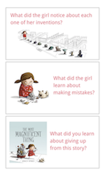

<header class='header' title='Mystery Robot' subtitle='Lesson 01'/>

<notable>
<iconp src='/icons/activity.png'>### Overview</iconp>
In lesson 1 students are introduced to the concept of productive failure through a story about a little girl and her quest to build a magnificent machine. Students discuss their takeaways from the story and apply the productive failure mindset to solve a mystery.

<iconp src='/icons/objectives.png'>### Objectives</iconp>
- I can identify what I learned from my mistakes.

<iconp src='/icons/agenda.png'>### Agenda (30 min)</iconp>

1. Engage: The Most Magnificent Thing (8 min)
1. Explore: Mystery Robot (10 min)
1. Explain: Process of Elimination (2 min)
1. Elaborate: Mystery Robot Round 2 (8 min)
1. Evaluate: Debrief (2 min)

<note>
<iconp src='/icons/materials.png'>### Materials</iconp>
###### Teacher Materials:
- [ ] Computer
- [ ] Projector
- [ ] *The Most Magnificent Thing*
- [ ] [Robot Cards][robot-cards]
- [ ] [Slide Show][slide-show]

###### Student Materials:
- [ ] Dry Erase Markers
- [ ] Felt Erasers
- [ ] [Laminated Robot Boards][robot-boards]

</note>

<pagebreak/>

## Room Design

<note borderLeft='2px solid green' mt='2em'>
###### Symbols Key

<iconp ml='1.65em' type='question'>question</iconp>
<iconp ml='1.65em' type='answer'>answer</iconp>
- [ ] action item
</note>

<pagebreak/>
## 1. Engage: *The Most Magnificent Thing* (8 min)

- [ ] **Read** *The Most Magnificent Thing* while stopping to ask the class questions.

<iconp type='question'>Page 22: Why did the girl give up?</iconp>
<iconp type='answer'>The girl gave up because she tried to build her invention many times and she thinks she can’t do it.</iconp>

<note></note>

<iconp type='question'>Page 26: What did the girl notice about each one of the inventions?</iconp>
<iconp type='answer'>The girl noticed that some of the inventions she thought were no good had parts that she liked.</iconp>

<iconp type='question'>Page 29: What did the girl learn about making mistakes?</iconp>
<iconp type='answer'>The girl learned that you can learn from your mistakes?</iconp>

- [ ] **Discuss** the message the book sends with the class.

<iconp type='question'>What did you learn about giving up from this story?</iconp>

- [ ] **Explain** how the story relates to coding.
>>“When we code we will all make mistakes, but that's ok because mistakes are a part of coding. The important things to remember are that we will keep trying and do our best to learn from our mistakes, just like the girl in the story."

<note></note>

## 2. Explore: Mystery Robot (10 min)

**How to Play**
- Pass out a board, eraser, and marker to each student.
- Draw a card from the deck.
- Have students attempt to identify the robot selected by asking questions about its color, shape, size, and number.
- After each question have students cross out robots that don't match the mystery robot's attributes.
- Continue the question and elimination process until a student has determined the mystery robot's identity.

- [ ] **Introduce** the Mystery Robot game.
>> “We are going to play a game in which we are going to solve a mystery. You each have a board with 25 different robots. In my hand I have cards with the same robots. I am going to choose one of the robots from my cards. Your goal will be to figure out which robot I chose by asking me questions about it. You can ask me questions about the robot's color, shape, size, and number."

- [ ] **Model** how to ask questions about the robot’s attributes.
>> “To ask about the robot's color we can ask questions like 'Is the robot blue?' or 'Is the robot red?'. We can also ask about the robot's size. We can ask 'Is the robot big?' or 'Is the robot small?'. We can also ask about the robot's shape by asking questions like 'Does the robot have a square?' or 'Does the robot have a star?'. We can even ask about the robot's number by asking questions like 'Is the robot number 5?' or 'Is the robot number 12?'."

- [ ] **Guided Practice:** Play the game and have the class practice asking questions and crossing out options after each question. Use the slide of the robot board to model crossing out options after a question has been asked.

## 3. Explain: Productive Failure (2 min)
- [ ] **Explain** the game's connection to productive failure.
>>"When we play this game we are going to make mistakes. Before we ask a question we may think we know who the mystery robot is, but we may be wrong. As we ask questions we will learn more and more about who the robot is no matter if our guess was right or wrong. For example, if I think the robot is red, I may ask 'Is the robot red?'. If the robot is not red I still learned something about the mystery robot because I now know the mystery robot is not red and I can cross out all of the red robots."

## 4. Elaborate: Mystery Robot Round 2 (8 min)
- [ ] **Remind** students of the attributes they can ask about in the Mystery Robot game.

- [ ] **Play** Mystery Robot. Support students as they play by crossing out options on the robot board slide.

## 5. Evaluate: Debrief (2 min)
- [ ] **Remind** students of the lesson that was learned from reading ***The Most Magnificent Thing***.
>> “When we read The Most Magnificent Thing we learned that it is possible for us to learn from our mistakes as long as we don’t give up.”

- [ ] **Share Out:** Students share their responses to the question below.

<iconp type='question'>How was the lesson we learned about making mistakes and not giving up helpful in playing the game?</iconp>

</notable>

[slide-show]: https://drive.google.com/open?id=1bIGou3ARKNB78DqcmsXUgywcwctqkx-pHWLKNK5IzpU
[robot-boards]: https://drive.google.com/open?id=0B48_2vIyABioa0Z0WXFfbFllaGc
[robot-cards]: https://drive.google.com/open?id=0B48_2vIyABioRWN5b2ZtM0JWcE0
