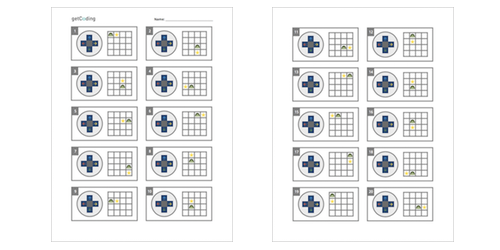

<header class='header' title='pixelBotGo' subtitle='Lesson 02'/>

<notable>
<iconp src='/icons/activity.png'>### Overview</iconp>
In lesson 2 students develop a set of commands to communicate with their PixelBot. The commands are then used to code solutions for a series of navigation challenges that require a single line of code.

<iconp src='/icons/objectives.png'>### Objectives</iconp>
- I can develop and use a set of commands to direct my PixelBot’s movements.

<iconp src='/icons/agenda.png'>### Agenda (30 min)</iconp>

1. Engage: Toothbrushing (5 min)
1. Explore: Navigation (8 min)
1. Explain: pixelBotGo (5 min)
1. Elaborate: pixelBotMove (7 min)
1. Evaluate: Debrief (5 min)

<note>
<iconp src='/icons/materials.png'>### Materials</iconp>
###### Teacher Materials:
- [ ] Computer
- [ ] Projector
- [ ] Toothbrush
- [ ] Tube of Toothpaste
- [ ] Floor Grid
- [ ] [Paper Star][paper-star]
- [ ] [Slide Show][slides]

###### Student Materials:
- [ ] [Game Controllers][paper-controllers]
- [ ] [Navigation Cards][direction-cards]
- [ ] [Navigation Worksheet][worksheet]

<iconp src='/icons/vocab.png'>### Vocabulary</iconp>
- **Code:** A set of instructions designed to be carried out by a computer.
</note>

<pagebreak/>

## Room Design

<note borderLeft='2px solid green' mt='2em'>
###### Symbols Key

<iconp ml='1.65em' type='question'>question</iconp>
<iconp ml='1.65em' type='answer'>answer</iconp>
- [ ] action item
</note>

<pagebreak/>

## 1. Engage: Toothbrushing (5 min)
**Location:** Rug

- [ ] **Introduce** the toothbrushing activity.
>> “I need your help. I have forgotten how to brush my teeth. I brought my toothpaste and toothbrush so that you can teach me how.”

<iconp type='question'>What should I do to brush my teeth? Tell me what I should do one step at a time.</iconp>

<note type='key' title='Key Points'>The purpose of this activity is for students to see how important it is to give clear and precise directions when communicating with a computer. Follow all student directions literally to show how unclear directions can lead to undesired outcomes. For example, if a student says to place toothpaste on the toothbrush, place the tube of toothpaste on the toothbrush.</note>

- [ ] **Debrief** the activity.
>> “This year we will learn how to give computers instructions. This is what we call coding. When we give instructions to a computer we have to make sure our directions are clear because a computer can’t figure out what we mean in the same way a person can. Today we are going to create instructions that we can give our computer."

## 2. Explore: Navigation (8 min)
**Location:** Rug

- [ ] **Introduce** the grid navigation activity. Stand on the floor grid and place the paper star in an adjacent square.
>> “I am standing in a square and there is a star in the square next to me. I want to move to the square with the star but I don't know how to get there.”

- [ ] **Share Out:** Have students share ideas of how they will direct the you to the star on the grid.
<iconp type='question'>What instructions would you give me to get to the star?</iconp>

- [ ] **Introduce** the next challenge in which students must complete the same task without using their voices.
>> “In this next challenge, I want to stand in the square with the star again. This time you have to give me instructions without using your voice.”

- [ ] **Share Out:** Have students share ideas about how they will direct you to the star on the grid.
<iconp type='question'>How would you give me instructions without using your voice?</iconp>

- [ ] **Introduce** the next challenge in which the class must complete the same task using a set of direction cards.
>> “I want to get to the star again. This time you have to give me instructions by using the cards that I just gave you.”

- [ ] **Share Out:** Have students share ideas of how they will direct the you to the star on the grid.
<iconp type='question'>How would you give me instructions with the card?</iconp>

- [ ] **Demonstrate** how to use the directions cards by holding the card to point at the square you want to move to.

## 3. Explain: pixelBotGo (5 min)
**Location:** Rug

- [ ] **Introduce** the grid navigation activity with game controllers.
>> “Now that we know how to use the arrows we can use our game controllers to to give instructions. In this activity you are going to continue to give me instructions in order to move me to the star. This time you will press the arrow button that you think will move me to the star.”

<note></note>

- [ ] **Demonstrate** how to properly hold the game controller with two hands. Each student should have their left thumb on the arrow buttons.

- [ ] **Check** students to ensure that they are holding the game controller properly.

- [ ] **Show** the first challenge. Stand on the grid and place the paper star in an adjacent square. Have the class press the button on the controller they would use to direct you to the star.

- [ ] **Share Out:** Have students share out the button they pressed to give you directions.
<iconp type='question'>Which color arrow did you press to move me to the square with the star?</iconp>

- [ ] **Show** the next challenge and have students share their responses in the same manner. Continue this process until students have had to use all 4 arrow directions on the game controller.

## 4. Elaborate: pixelBotMove (7 min)
**Location:** Desks
- [ ] **Display** the navigation worksheet on the board using the slide show.

- [ ] **Model** completing the first challenge and have students copy the solution on their worksheet.
>> “To complete this challenge I have to circle the arrow direction that I would use to move the turtle to the star. In this first challenge I need to move my turtle to the right. I will circle the yellow arrow because the yellow arrow points to the right. Circle the yellow arrow on your worksheet to show the correct answer.”

- [ ] **Guided Practice:** Have the class assist in completing the second challenge on the worksheet by having individuals students volunteer to share their answers.
>> “In this next challenge I’m going to need your help.”

<iconp type='question'>Which color arrow should I circle to get my turtle to move to the star?</iconp>

- [ ] **Independent Practice:** Students complete the navigation worksheet independently.

- [ ] **Monitor** the class for students in need of additional assistance.

- [ ] **Review** 2-3 challenges from the navigation worksheet with the class.

## 5. Evaluate: Debrief (5 min)
**Location:** Desks
- [ ] **Debrief** the lesson with the class.
>> “In this lesson we were able to come up with a set of instructions to communicate with our PixelBot.”

<iconp type='question'>What did we use to give our PixelBot directions?</iconp>
<iconp type='answer'>We used arrows to give our PixelBot directions.</iconp>

<iconp type='question'>Why do you think it was important for us to create simple instructions for our PixelBot to follow?</iconp>

</notable>

[slides]: https://drive.google.com/open?id=1Ff8QsgmBG1q5Pa-Kq14IPe-3HArs8f7EAW73lxKFVBk
[paper-star]: https://drive.google.com/open?id=0B48_2vIyABioYThreXZIU3d5ckU
[paper-controllers]: https://drive.google.com/open?id=0B48_2vIyABioZ0Mzd3J5aURHMTg
[direction-cards]: https://drive.google.com/open?id=0B48_2vIyABioTDhLa1RYaDVzalE
[worksheet]: https://drive.google.com/open?id=0B48_2vIyABioOGZFVEgzc0d4cFE
