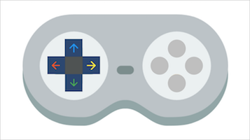
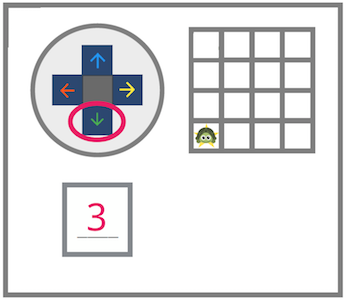

<header class='header' title='Multiple Steps' subtitle='Lesson 03'/>

<notable>
<iconp src='/icons/activity.png'>### Overview</iconp>
In lesson 3 students use multiple commands to direct their pixelBot’s movement.

<iconp src='/icons/objectives.png'>### Objectives</iconp>
- I can use more than one command to move my pixelBot.

<iconp src='/icons/agenda.png'>### Agenda (30 min)</iconp>

1. Engage: Review (5 min)
1. Explore: Turtle Chase Video Game (7 min)
1. Explain: Multiple Commands (5 min)
1. Elaborate: turtleMove II (10 min)
1. Evaluate: Exit Ticket (3 min)

<note>
<iconp src='/icons/materials.png'>### Materials</iconp>
###### Teacher Materials:
- [ ] Computer
- [ ] Projector
- [ ] Floor Grid
- [ ] [Paper Star][star]
- [ ] [Slide Show][slides]

###### Student Materials:

- [ ] [Game Controllers (1 per student)][controller]
- [ ] [Navigation Worksheet (1 per student)][worksheet]
- [ ] [Exit Tickets (1/2 sheet per student)][exit-ticket]

<iconp src='/icons/vocab.png'>### Vocabulary</iconp>
- **Code:** A set of instructions designed to be carried out by a computer.
</note>

<pagebreak/>

## Room Design

<note borderLeft='2px solid green' mt='2em'>
###### Symbols Key

<iconp ml='1.65em' type='question'>question</iconp>
<iconp ml='1.65em' type='answer'>answer</iconp>
- [ ] action item
</note>

<pagebreak/>

## 1. Engage: Review (5 min)
**Location:** Rug

- [ ] **Review** using arrow commands by standing on a square on the floor grid and placing the paper star in an adjacent square.

- [ ] **Share Out:** Have students share their responses to the question below.
<iconp type='question'>Which button would you press to direct me to the star?</iconp>

## 2. Explore: Turtle Chase Game (7 min)
**Location:** Rug

**How to Play:**
- Divide the class into two teams, team turtle and team rabbit.
- Select two volunteers to play the role of the turtle and the rabbit in the game.
- Have the turtle and the rabbit stand on opposite corners of the floor grid.
- The goal of the game is for the turtle to "catch" the rabbit by standing in the same square with the rabbit.
- Players from each team take turns directing their character on the grid by sharing out the control they want to press. The character then moves in the direction that matches the button selected.
- Teams continue taking turns until the turtle catches the rabbit.

- [ ] **Introduce** the turtle chase game.
>> “We are going to play a video game using our game controllers. In this game instead of controlling characters on a computer screen we are going to control characters on the floor grid.”

<note></note>

- [ ] **Explain** how to play the turtle chase video game, choose two volunteers to play, and divide the class into two teams, team turtle and team rabbit.
>> “We will have two volunteers pretend to be a turtle and a rabbit. The goal of the game is for the turtle to catch the rabbit by standing in the same square with it. Those of us that are not on the grid will get to control the players on the grid using the arrow buttons we used last class. Half of the class will control the rabbit with their controller. The other half of the class will control the turtle.”

- [ ] **Play** the turtle chase video game as a class.

## 3. Explain: Multiple Commands (5 min)
**Location:** Desks

- [ ] **Show** the first multiple commands challenge in the slide show.

- [ ] **Model** solving a multiple commands challenge.
>> “In this challenge my turtle needs to move to the star. I'm going to circle the green arrow that is pointing down because my turtle needs to move down to get to the star. If I press the down arrow button once my turtle will only move once. My turtle needs to move more than one time, so I should count the number of times my turtle needs to move. 1, 2, 3. It looks like my turtle should move down 3 times, so I will write a 3 in the space below.”

<note></note>

- [ ] **Guided Practice:** Pass out the navigation worksheet and complete the first challenge as a class.

<iconp type='question'>Which arrow should we press to move the turtle to the star?</iconp>
<iconp type='question'>How many times should we press the button to get the turtle to the star?</iconp>

## 4. Elaborate: turtleMove II (10 min)
**Location:** Desks

- [ ] **Independent Practice:** Students complete the navigation worksheet independently.

- [ ] **Monitor** the class for students in need of additional assistance.

- [ ] **Review** 2-3 challenges from the navigation worksheet with the class.

## 5. Exit Ticket (3 min)
**Location:** Desks

- [ ] **Exit Ticket:** Have students complete the exit ticket independently.

- [ ] **Monitor** the class for students in need of additional assistance.
</notable>

[star]: https://drive.google.com/open?id=0B48_2vIyABioYThreXZIU3d5ckU
[slides]: https://drive.google.com/open?id=1sEgDN-IjoNcAdUqGP7Vlm5bqLMkpUa1Agt_x6rCLoTU
[controller]: https://drive.google.com/open?id=0B48_2vIyABioZ0Mzd3J5aURHMTg
[worksheet]: https://drive.google.com/open?id=0B48_2vIyABioVXY5UVFGYkJWNjA
[exit-ticket]: https://drive.google.com/open?id=0B48_2vIyABioaFVIRkxLeEstZEk
