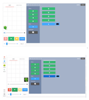

<header class='header' title='PixelBots' subtitle='Lesson 06'/>

<notable>
<iconp src='/icons/activity.png'>### Overview</iconp>
In lesson 5 students begin writing code on the the PixelBot platform.

<iconp src='/icons/objectives.png'>### Objectives</iconp>

 - I can control the actions of my PixelBot with code.

<iconp src='/icons/agenda.png'>### Agenda (30 min)</iconp>

1. Engage: PixelBot Predictions (5 min)
1. Explore: Challenge (5 min)
1. Explain: PixelBot 101 (5 min)
1. Elaborate: PixelBot Playlist (10 min)
1. Evaluate: Debrief (5 min)

<note>
<iconp src='/icons/materials.png'>### Materials</iconp>
###### Teacher Materials:
- [ ] Computer
- [ ] Projector
- [ ] [Slide Show][slides]

###### Student Materials:
- [ ] Computers
- [ ] [Playlist: K.05 Practice | Code: ZOMOP][ind-practice]
- [ ] [Playlist: K.05 Bonus | Code: QBRWI][extension]

<iconp src='/icons/vocab.png'>### Vocabulary</iconp>

- **Sequence** - A set of actions that must be performed in the order they are written.

- **Code:** A set of instructions designed to be carried out by a computer.

</note>

<pagebreak/>

## Room Design

<note borderLeft='2px solid green' mt='2em'>
###### Symbols Key

<iconp ml='1.65em' type='question'>question</iconp>
<iconp ml='1.65em' type='answer'>answer</iconp>
- [ ] action item
</note>

<pagebreak/>
## 1. Engage: Predictions (5 min)
- [ ] **Show** the PixelBot sequence.
- [ ] **Turn and Talk:** Student predict what the PixelBot would do if it followed the directions in the sequence.

<iconp type='question'>If our PixelBot followed the directions in the sequence in order, where would it stop?</iconp>

- [ ] **Share Out:** Students share their predictions with the class. As they share out, challenge them explain their thinking with the question below.

<iconp type='question'>Why do you think that would happen?</iconp>

<note></note>

- [ ] **Show** the class the result of running the code in PixelBot.

- [ ] **Explain** that in this lesson our goal is to learn how to write code in pixelBot.

## 2. Explore: Challenge (5 min)
- [ ] **Explain** the goal of the challenge.
>> “In this challenge our goal is to move our PixelBot to the square above and paint it. Your job is to try to do that by writing a sequence of code.”

- [ ] **Explain and demonstrate** how to write and delete code in PixelBots using challenge 1 from the student playlist.
>>"To write your code you can just point and click on the code you want to add. If you make a mistake you can delete your code by clicking the trash can next to it."

- [ ] **Independent Exploration:** Have students attempt to complete the first challenge in the playlist.

- [ ] **Discuss** the different strategies that students tried during the challenge.

<iconp type='question'>What are some things you tried to complete the challenge?</iconp>

- [ ] **Model** how to solve the challenge.
>> “I will select an up arrow block because my PixelBot needs to move up to get to the square. Then I will click the paint block to paint the square. To make my PixelBot act out my code I will press the green run button.”

## 3. Explain: pixelBot 101 (5 min)
- [ ] **Review and demonstrate** how to add code in the pixelBot editor using challenge 2.
>> “I can add code by selecting blocks of code on the left. The code I can add includes arrows that make the PixelBot move and the paintbrush that makes it paint.”

- [ ] **Explain and demonstrate** what running code means and how to do it.
>> “When we run code we are simply telling the computer to follow the directions we wrote. To run the code we wrote we press the big green button.”

- [ ] **Explain and demonstrate** how to delete code in the pixelBot editor.
>> “Sometimes when we write code we make mistakes. We may add code that we don’t want. To delete the code we can click the trash can next to the block of code we don’t want.”

- [ ] **Guided Practice:** Have students navigate to challenge 2 help you solve it by sharing their thoughts.
>> “My goal is to make my PixelBot paint the square on the right. What should I do?”

- [ ] **Share Out:** Students share out ideas as you code and test them out in the PixelBots editor.

## 4. Elaborate: pixelBot Playlist (10 min)
- [ ] **Independent Coding:** Students work through the rest of the challenges in the PixelBot playlist.

- [ ] **Monitor** the class for students in need of additional assistance.
- [ ] **Extension:** Have students who finish early work on the PixelBot extension playlist.

## 5. Evaluate: Review & Debrief (5 min)
- [ ] **Review** 1-2 challenges from the Playlist with the class.
- [ ] **Debrief** the lesson with the class.

<iconp type='question'>What was challenging about today's lesson?</iconp>

</notable>

[slides]: https://drive.google.com/open?id=1ean8naFUkfNz0ntGLzHQzfmtFkctSoI8hKEruMHbujQ
[ind-practice]: http://www.pixelbots.io/ZOMOP
[extension]: http://www.pixelbots.io/QBRWI
[assess]: https://artbot-26016.firebaseapp.com/V3ZP3
